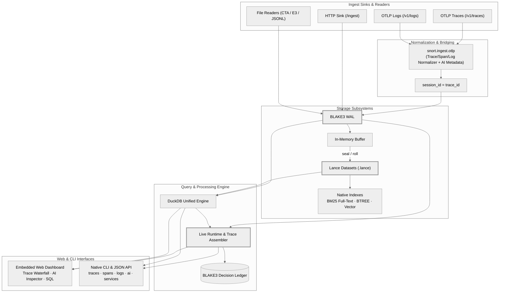

# snort

plug-and-play telemetry store, search engine, and trace grouping tool.

drop the single binary anywhere and run it. it starts an embedded web dashboard and an http network sink so you can stream logs and telemetry directly into durable storage with zero setup.

## capabilities

- drop-and-run binary: single file executable with zero external dependencies.
- network ingest sink: post json or jsonl events over http with durable write-ahead logging.
- opentelemetry support: native OTLP/HTTP trace (`/v1/traces`) and log (`/v1/logs`) ingest compatible with motel, effect, and standard otel exporters.
- embedded web dashboard: live search bar, trace waterfall viewer, ai call inspector, real-time store statistics, and drag-and-drop ingest.
- native cli commands: instant terminal inspection of traces, spans (with ASCII waterfall trees), logs, services, and ai call metrics without a heavy tui.
- columnar storage: wal segments seal into immutable lance files with native duckdb vector and full-scan support.
- unified search: duckdb queries sealed lance files and the unsealed wal tail simultaneously in a single pass.
- hybrid text retrieval: native lance bm25 search combined with exact boolean sql filters.
- trace grouping: reconstructs execution traces, tracks evidence, and assigns threat groups.
- tamper-evident lineage: blake3 cryptographic hash chains protect every event, segment, and decision ledger.
- cross-platform releases: standalone binaries for macos, linux, windows, and android; a separate demonstration APK.



## quick start

### 1. start the engine

simply run the binary with no arguments. it opens the network sink and dashboard automatically:

```bash
./snort
```

or specify custom port and data directory:

```bash
./snort serve --port 8080 --data-dir ./snort_data
```

open your browser at `http://127.0.0.1:8080` to access the dashboard.

### 2. stream telemetry into the sink

#### a. OpenTelemetry (OTLP/HTTP)
point your app's OTLP exporters directly at snort:

```bash
export OTEL_EXPORTER_OTLP_TRACES_ENDPOINT="http://127.0.0.1:8080/v1/traces"
export OTEL_EXPORTER_OTLP_LOGS_ENDPOINT="http://127.0.0.1:8080/v1/logs"
```

#### b. Raw JSON or JSONL lines
pipe json lines directly to the ingest endpoint using curl, fluentbit, or any agent:

```bash
curl -X POST http://127.0.0.1:8080/ingest \
  -H "Content-Type: application/json" \
  -d '[
    {"ts": "2024-01-01T12:00:00Z", "host": "web-srv", "action": "exec", "raw": "powershell -enc test1234"},
    {"ts": "2024-01-01T12:01:00Z", "host": "web-srv", "action": "connect", "raw": "nginx connect 10.10.10.1"}
  ]'
```

### 3. terminal inspection (cli & ai agents)

query assembled traces, render ASCII waterfall trees, stream logs, and inspect ai calls without a heavy tui:

```bash
# list recent traces
snort traces --limit 20

# render an ASCII waterfall tree for a specific trace
snort spans --trace-id 4bf92f3577b34da6a3ce929d0e0e4736

# inspect span details & correlated logs
snort spans 5fb397be34d23b0f

# stream logs
snort logs --severity ERROR

# inspect AI SDK / LLM calls & token metrics
snort ai

# list reporting services
snort services
```

### 4. search events

search across live wal and sealed lance segments via the web ui or rest api:

```bash
curl "http://127.0.0.1:8080/api/search?q=powershell"
curl "http://127.0.0.1:8080/api/search?q=powershell&bm25=true&filter=host%20%3d%20%27web-srv%27"
```

or use the command line:

```bash
snort search "powershell" --data-dir ./snort_data
snort search "powershell" --data-dir ./snort_data --bm25 --filter "host = 'web-srv'"
```

### 4. sql analytics

run bounded, read-only sql queries directly against events and runtime tables:

```bash
snort query "select host, count(*) as count from events group by host" --data-dir ./snort_data
```

### 5. seal and build indexes

seal active wal files into immutable lance columnar datasets and build bm25 indexes:

```bash
curl -x post http://127.0.0.1:8080/api/seal
```

or via cli:

```bash
snort seal --wal-dir ./snort_data/wal --sealed-dir ./snort_data/sealed
snort index --sealed-dir ./snort_data/sealed --index-dir ./snort_data/index
```

### 6. verify storage integrity

verify the blake3 cryptographic hash chains across all wal segments and sealed files:

```bash
snort verify --wal-dir ./snort_data/wal --sealed-dir ./snort_data/sealed
```

## storage layout

all data is stored locally in clean, human-readable directories inside your data path:

```
snort_data/
├── wal/             # append-only tamper-evident jsonl event logs
├── sealed/          # immutable columnar lance datasets (.lance)
├── index/           # bm25 inverted full-text indices
├── ledger/          # blake3 hash-chained decision ledgers
└── runtime.sqlite3  # checkpoint receipts, traces, and model state
```

## downloads

prebuilt standalone binaries available on github releases:

- `snort-macos-arm64`: macos apple silicon (m1/m2/m3/m4)
- `snort-linux-x86_64`: linux 64-bit x86
- `snort-linux-arm64`: linux 64-bit arm
- `snort-windows-x64.exe`: windows 64-bit
- `snort-android-arm64`: android command-line executable
- `snort-android-arm64.apk`: signed android demonstration UI. the app is labeled
  "snort demo" (`com.snort.demo`) and does not include the native engine, offline
  analysis, models, rules, or telemetry datasets. use the snort cli or http service
  for real analysis.
