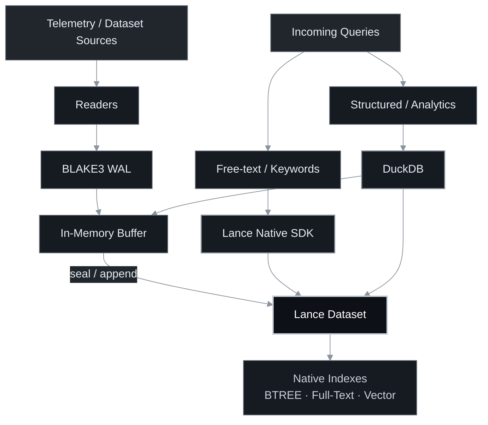

  

single-process telemetry store and trace grouping engine with lance, duckdb, and blake3 tamper proofing.

## capabilities

- live ingestion: append incoming json or cta events directly to an append-only wal.
- columnar storage: seal wal segments into immutable lance datasets with blake3 hash tracking.
- fast search: query sealed lance files and the unsealed wal tail in a single pass using duckdb.
- hybrid text retrieval: rank hits with lance bm25 full-text indexing and boolean sql filters.
- trace grouping: group related events and score pairs without multi-process overhead.
- tamper verification: verify that stored files and decision ledgers have not been altered.
- cross-platform: prebuilt binaries for linux, macos, windows, and android.

## Query Architecture


## install


download prebuilt binaries from github releases or install locally:

```bash
git clone https://github.com/maceip/snort.git
cd snort
python -m venv .venv
source .venv/bin/activate
pip install -r requirements.txt -e .
```

## usage

### 1. run the end-to-end demo

```bash
snort demo --out bench/results/demo
```

### 2. ingest raw events

```bash
snort ingest --format jsonl --wal-dir wal events.jsonl
```

### 3. seal to lance

```bash
snort seal --wal-dir wal --sealed-dir sealed
```

### 4. build indexes

```bash
snort index --sealed-dir sealed --index-dir index
```

### 5. search evidence

fast scan over sealed segments and wal tail:

```bash
snort search "powershell" --sealed-dir sealed --wal-dir wal
```

hybrid bm25 full-text search with structured filter:

```bash
snort search "powershell" --sealed-dir sealed --bm25 --filter "host = 'ws-2'"
```

### 6. verify store integrity

```bash
snort verify --wal-dir wal --sealed-dir sealed
snort verify-ledger bench/results/demo/ledger.jsonl
```

## releases

prebuilt standalone files published on github releases:

- `snort-macos-arm64`: macos apple silicon
- `snort-linux-x86_64`: linux 64-bit x86
- `snort-linux-arm64`: linux 64-bit arm
- `snort-windows-x64.exe`: windows 64-bit
- `snort-android-arm64`: android termux / shell binary
- `snort-android-arm64.apk`: android app package installable via adb
