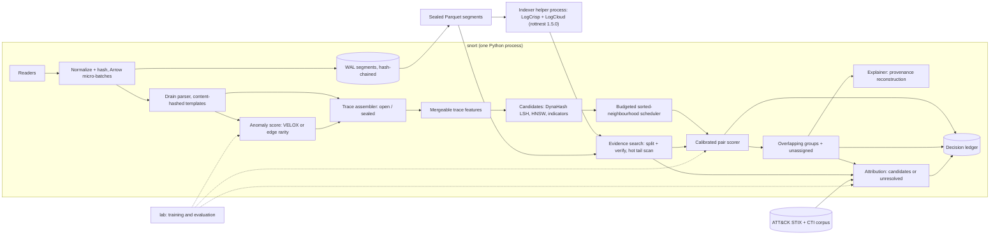

# snort: end-to-end build plan

Status: proposal, third version. Every repository linked in `docs/sota/repos.md` has been run on its own data, with one note each in `docs/assessment/`:

| Note | Repositories |
|---|---|
| `logcloud.md` | logcloud, rottnest |
| `threattrace.md` | ThreatTrace |
| `tracegram.md` | Tracegram |
| `dynahash-per.md` | DynaHash, PER |
| `blockingpy.md` | BlockingPy |
| `pidsmaker-velox.md` | PIDSMaker and VELOX |
| `orthrus.md` | ORTHRUS |
| `unveiling-ctas.md` | Unveiling-CTAs |
| `jev-ids.md` | jev-ids |

§2.1 summarises what the runs changed, stage by stage. Numbers marked "target" are starting points, to be replaced by measured baselines.

Scope: one person, one workstation, one process, demonstrating all six stages from `docs/sota/origin/md` end to end on public data.

## The bet, and why it should work

**What we are building.** The opportunity in `origin/md` is retrieval-driven attribution:

> incoming traces → behavioural representations → candidate retrieval → evidence-based scoring → overlapping groups → attribution updated as evidence arrives

"Unresolved" is a first-class answer, and behavioural similarity is kept separate from identity. No published system does all six stages; each paper demonstrates one. This plan builds the whole loop once, on one workstation, on public data with ground truth, and measures it. That measurement is the gap `origin/md` names: end-to-end validation.

**The bet.** Behavioural similarity between traces is strong enough to *find* related activity but not strong enough to *name* an actor on its own. The system therefore:
1. retrieves generously;
2. decides each link with calibrated evidence;
3. never closes links transitively;
4. attributes only when independent kinds of evidence agree.

**Evidence that similarity finds related activity** (measured here):
- **Attacker sessions:** on 9,988 real sessions from 94 actors, a session's nearest neighbour belongs to the same actor 86% of the time.
- **LSH recall:** DynaHash reproduces at 0.96–0.99.
- **Detection:** plain activity counts detect attack windows at AUC 0.93 on FedCSIS.
- **Actor ranking:** TF-IDF ranks command sessions to the right actor 92–96% of the time on a random split.

**Evidence that similarity is not identity** (also measured here):
- **Chaining links:** chaining those same 86%-pure links into connected components drops purity to 67%, and one component merges 7 actors.
- **Over time:** actor accuracy falls from 0.95 to 0.65–0.80 once training data comes only from the past.
- **The best published LLM approach:** AURA reaches 83–87% top-1 on 30 reports.

Any design that turns similarity directly into a label mislabels at a rate an analyst cannot accept: blocking components, hard clusters, or one classifier's argmax. That is the measured case for overlapping groups and "unresolved".

**Why these components, and not the obvious alternatives:**

| Stage | Choice | Rejected alternative | Measured reason |
|---|---|---|---|
| 1 Ingest | Parquet we write, indexed by rottnest's Rust LogCloud, with split-and-verify search | C++ LogCloud; grep alone | C++ missed 22 of 40 lookups at 961 MB; Rust found 40 of 40 in about 1.3 s. A Phase 2 bake-off against plain scans decides whether the index stays |
| 2 Represent | Activity counts, pooled token vectors, MinHash, timing, all mergeable per event | ThreatTrace's pipeline; Tracegram's aggregator | Counts 0.927 vs ThreatTrace 0.915 on its own data; pooled 1-NN ties Tracegram (1.000). Both alternatives recompute in batch |
| 3 Retrieve | DynaHash (fixed), HNSW and indicators, capped at 50 | BlockingPy's components | Links are 86% pure, components 67%. BlockingPy rebuilds its index on every call |
| 4 Score | Sorted-neighbourhood scheduling, calibrated pair model | NN + BFS; PESM | PER's own deduplication results favour sorted neighbourhood; PESM does not reproduce |
| 5 Group, explain | Overlapping memberships from calibrated links; an anomaly score that has passed our own ADP check; DepImpact reconstruction across windows | Fuzzy c-means; ORTHRUS's GNN | Fuzzy memberships always sum to 1 and added nothing (0.920 without, 0.910 with). Bilot et al. report VELOX matching ORTHRUS (ADP 0.94) without test-data snooping, but three runs here reached at most 0.14, so no anomaly score is trusted until it passes our own ADP check |
| 6 Attribute | TF-IDF + logistic regression and ATT&CK retrieval, fused against an explicit unknown actor | The CTA hybrid; LLM-decided attribution (AURA) | TF-IDF beats the hybrid on both splits. AURA has 30 test reports and no evidence weights, so an LLM may explain but not score |

**What is new and unproven.** No paper answers these about the joined loop:
1. Do traces built from streaming telemetry keep each attack in a few pure traces?
2. Does trace-level similarity separate same-attack pairs from unrelated pairs on provenance data, not only on commands?
3. Does the loop keep up at 10× replay on one machine?

Phase 0's go/no-go tests answer 1 and 2 within three weeks; Phase 1 answers 3.

**What would change the plan:**
- **Trace boundaries fail (go/no-go 1):** redefine them (for example, session or beacon instead of process subtree) before building anything on them.
- **No representation separates same-attack pairs** (AUC below 0.8, go/no-go 2): the system ships as evidence search plus provenance reconstruction (stages 1 and 5) without behavioural grouping, and the report says so.
- **Attribution precision stays below 0.95 at useful coverage in the emulation lab:** attribution stays at *candidates*.

**Why one workstation is enough.** Measured on 4 CPU cores:
- E3-CADETS graphs build in 4 minutes;
- a VELOX training epoch takes about 1.5 minutes;
- DynaHash inserts about 1,000 sealed traces per second;
- LogCloud indexes about 4 MB/s;
- the CTA classifier trains in seconds.

Nothing on the live path needs a GPU.

## 0. Definition of done

One command, `snort demo`, on the reference workstation and from a clean checkout:
1. Replays DARPA E3-CADETS, then the composite stream (§7.1), at 10× real time.
2. Produces groups of related traces with their evidence, ORTHRUS-style attack graphs, and for each group either ranked actor candidates or "unresolved".
3. Passes `snort verify` on the decision ledger.
4. Writes a metrics report comparing every stage with its baseline, plus the ablation table (§7.4).

Everything in this plan exists to make that command produce honest numbers.

## 1. Decisions

1. **Python first, in one process, with native libraries doing the heavy work.**
   - **Process:** the live path is one Python process. It uses Arrow and Polars micro-batches, RocksDB, usearch, LightGBM, ONNX Runtime and rottnest's Rust LogCloud.
   - **The one exception:** segment indexing runs in a helper process, because LogCrisp writes into its working directory, is not reentrant, and can crash on bad input.
   - **Porting:** a component moves to Rust only once profiling shows it is the bottleneck. The port is validated against the Python version on the same seeds.
   - **Why:** most of the linked code is Python or has Python bindings; the plan is sized for one person; and end-to-end evidence matters more than raw speed early on.
2. **Run every repository before relying on it.** Running all eleven found these classes of problem:
   - wrong formulas (DynaHash's table count, ThreatTrace's std);
   - silent record loss or corruption (DynaHash keys, ThreatTrace's compaction);
   - missed search results and crashes (LogCloud);
   - dependencies that no longer install or that change results (rottnest, pyJedAI, PIDSMaker's dump format);
   - pipelines that do not run as shipped (ThreatTrace needed six patches);
   - evaluations that use test data or random splits (ORTHRUS, Unveiling-CTAs);
   - complex models that a simple baseline matches (Unveiling-CTAs, Tracegram);
   - published results that did not reproduce (VELOX: ADP 0.14 here against 0.94).

   Each adopted repository is therefore reproduced on its own data, pinned, given regression tests, and written up in `docs/assessment/` before its numbers are trusted. Status is in §2.
3. **One dataset end to end before adding more.** E3-CADETS first (about 10 GB, three attacks, node-level ground truth). Then THEIA and CLEARSCOPE, then the composite stream.
4. **Go/no-go tests before building on assumptions.** Two tests run in Phase 0:
   - whether the trace definition keeps each attack in a few pure traces;
   - whether behavioural similarity separates traces from the same attack from unrelated ones.

   If either fails, the representation is redesigned before anything downstream is built.
5. **Simplest working version first, at every stage.** Each stage ships with a baseline number. A more complex method replaces it only if it wins on the benchmark by a stated margin. This is the main lesson of *Sometimes Simpler is Better*, and the runs here repeated it in four stages (§2.1).
6. **Template IDs are content hashes.**
   - **Live features:** an online Drain parser supplies the tokens.
   - **Storage and search:** LogCrisp, via LogCloud, runs when a segment is sealed.
   - **Why hashing:** LogCrisp retrains its templates for every batch, so its IDs are not stable. Every template is identified by a hash of its normalized text, which makes both vocabularies stable and lets them be joined.
7. **Trace representations are mergeable summaries.** They combine:
   - activity counts (the measured stage-2 baseline);
   - ThreatTrace-style pooled embedding statistics;
   - a MinHash sketch;
   - a technique set;
   - a timing histogram.

   All of these update in O(1) per event while a trace is open.
8. **Candidates come from three indexes, unioned and capped:**
   - DynaHash LSH, using the authors' code with its defects fixed;
   - one HNSW index per modality;
   - an exact indicator index.

   BlockingPy is used offline only.
9. **Scoring follows Progressive Entity Matching, starting with sorted neighbourhood.** Trace linking is deduplication. In PER's own results sorted neighbourhood leads for deduplication at scale, so NN + BFS and Join are challengers. A calibrated gradient-boosted pair model makes the final match decision, and a compute budget bounds the work.
10. **Groups overlap, and "unassigned" is a valid state.** A trace belongs to zero to three groups. Merges and splits are recorded proposals, never transitive closure. Memberships express behavioural similarity, never identity.
11. **Attribution is a separate layer with an explicit "unknown actor" hypothesis.**
    - **Default output:** ranked candidates or "unresolved".
    - **The "attributed" level stays off** until its precision is measured across at least three held-out actors with independent evidence.
    - **Where that data comes from:** an emulation lab built in Phase 3 (§7.1), because no public dataset provides it.
    - **LLMs:** may draft explanations from cited evidence; they never set scores.
12. **Lineage is tamper-evident, not tamper-proof.** A BLAKE3 hash chain covers raw segments and every derived decision. Chain heads are signed with a key held outside the process; external copies of the heads, which make rollback detectable, are added once the core loop works.

## 2. What we keep from each repository

Status meanings:
- **Run:** reproduced on its own data here.
- **Read:** code inspected only.

| Repository | Keep | Leave | Status | Key findings |
|---|---|---|---|---|
| `marsupialtail/logcloud` (C++ LogCloud, published as `rottnest==1.0.4`) | The LogCrisp template trainer and compressor source (`vendored/LogCrisp_*`); the index format as the reference design | Its search and its `tail` mode | **Run** | 192 MB indexed in 25 s, about 21× smaller. At 961 MB, 22 of 40 exact-ID lookups returned nothing and some numeric queries crashed. Queries spanning a variable boundary (IP:port, template text) return nothing. `pip install rottnest` now installs 1.5.0, which lacks this code. |
| `marsupialtail/rottnest` (Rust LogCloud, `rottnest==1.5.0`) | The LogCloud index and search over Parquet segments we write ourselves, pinned with `getdaft==0.3.15` | — | **Run** | Same 961 MB: 40 of 40 exact lookups, about 1.3 s per query, about 4 MB/s indexing on 4 cores. Index is 229 MB on top of 105 MB Parquet (random IDs, close to the worst case). Shares the boundary-query problem; splitting the query and filtering for the full string fixed it in testing. Search breaks with current `getdaft`. |
| `dimkar121/DynaHash` | The code: MinHash, Hamming LSH, RocksDB store, multi-probe, ranked retrieval | — | **Run** | Recall reproduces (0.99, 0.96). About 1,000 inserts/s. Five defects to fix: hash-table count wrong for θ ≠ 0.5; same-key records collapse; T exists only in a demo script and keeps all vectors in RAM; multi-probe trees are static; input fixed to character 2-grams. Its RocksDB binding is missing from `requirements.txt`. |
| `JacobMaciejewski/PER-Design-Space-Exploration` | Runner and configs over pinned pyJedAI as the scheduling benchmark; sorted neighbourhood as the primary method | NN + BFS as the default | **Run** | Join reproduces exactly and sorted neighbourhood closely; PESM does not (unpinned pyJedAI). NN embedding took about 6 s per record on CPU. Shipped deduplication results favour sorted neighbourhood. |
| `ncn-foreigners/BlockingPy` | Offline ANN backend comparison and its blocking metrics (`eval()`) | The live path (rebuilds the index on every call, no incremental insert) and its connected-component blocks | **Run** | Tests pass; its benchmark reproduces (recall 0.90–0.91 at 15k records, 0.82 at 150k). On 9,988 CTA sessions, 86% of nearest-neighbour links join the same actor, but its connected components are only 67% pure: one block holds 1,031 sessions from 7 actors. Shared tooling chains actors together. |
| `janusza/ThreatTrace-Cyber-Attack-Detection` | The pooled `[count, mean, std, min, max]` vector as one feature family; mined-pair compaction as an ablated option; FedCSIS as a sanity check | The R implementation (regex compaction, `max` for `pmax`), fuzzy c-means, label-token GloVe | **Run** | Six patches to run (outputs that don't chain, a miner that doesn't finish). Basic-feature baseline reproduces (0.540). XGBoost gain is +0.011 here vs +0.049 published (0.915 vs 0.940). Plain activity counts score 0.927. Regex compaction changes 26.5% of traces; std features depend only on n; c-means adds nothing. |
| `YuchenZhang-Academic/Tracegram` | The formulation (a trace as a bag of instances with attention weights as evidence), as a Phase 3 option | The payload-based flow encoder; the claim that the temporal aggregator adds value | **Run** | Test F1 1.000 on bundled IoT-Sentinel reproduces, but mean-pooling the same flow vectors with 1-NN also scores 1.000. Its own logs show 0.876 without payload and an unreported dataset at 0.395. |
| `ubc-provenance/orthrus` | The DepImpact reconstruction algorithm, reimplemented with cross-window stitching; per-attack ground truth; evaluation rules | The GNN; the original config, which uses test data for word2vec and picks alerts by k-means over top test scores | **Read** (its reconstruction has not been run yet; see `orthrus.md`) | Reconstruction stays inside one 15-minute window. Not exactly reproducible (README: unset `PYTHONHASHSEED`). Non-snooped ADP on E3-CADETS is 0.94 (min 0.85), the same as VELOX (Bilot et al.). |
| `ubc-provenance/PIDSMaker` | Dataset dumps and converters; node-level ground truth; evaluation rules (5 seeds, ADP); VELOX only once it reproduces | The other detectors | **Run** | E3-CADETS restored (36.5M events). Graphs build in 4 min on CPU. VELOX did **not** reproduce: best ADP 0.143 against 0.94 published, across `main` default (0.008), `main` tuned (0.007) and the paper's `velox` branch with its tuned file (0.143). `main` lacks the tuned file, and its docs disagree with the branch. Training needed a memory patch to fit 15 GB. |
| `bogertaNET/Unveiling-CTAs` | The corpus (94 actors, 9,988 beacon sessions, timestamps, ATT&CK tactics) and the SCLC normalizer | The hybrid and BERT models; the random-split scores | **Run** | Shipped models reproduce exactly (0.951 / 0.938 / 0.893). TF-IDF + logistic regression beats them on the authors' own split (0.962 / 0.948 / 0.926). Time-forward, accuracy falls to 0.65–0.80 (hybrid 0.747 vs TF-IDF 0.797 at 4 actors). |
| `jev-sec/jev-ids` | Nothing | Everything | **Run** | Tests pass and its table recomputes from shipped predictions. The headline comparison is with a random forest trained on 5 examples; it classifies single NSL-KDD flows through a paid API and covers none of the six stages. |

Papers without separate code: AURA (adapt the retrieve-then-rank pattern with fixed scoring), TRACE (later: knowledge-graph extraction from reports), honeypot clustering (preprint link returns 403).

Corrections to `docs/sota/origin/md`:
- *Sometimes Simpler is Better* reports its simple network leading on **eight of nine** DARPA datasets, not five of seven.
- LogCloud's C++ implementation is `marsupialtail/logcloud`, and its Rust reimplementation is in `marsupialtail/rottnest`. `rottnest-vldb-repro` holds Rottnest's own benchmarks.
- LogCrisp's trainer and compressor code is public, vendored inside `marsupialtail/logcloud`.

### 2.1 What the reviews change, stage by stage

Every linked repository has now been run here, on its own data, and the CTA corpus has been rebuilt with timestamps. In the order of the brief:

1. **Ingest and retain searchable evidence (LogCrisp, LogCloud).**
   - **Kept:** rottnest's Rust LogCloud over Parquet segments we write, and LogCrisp's template trainer.
   - **What running it showed:** queries that cross a variable boundary return nothing, so search goes through the split-and-verify wrapper (§4.1). Templates are identified by content hashes because LogCrisp's IDs are per batch.
   - **Still open:** the Phase 2 bake-off decides whether LogCloud stays at all.
2. **Represent each trace's behaviour (ThreatTrace, Tracegram).**
   - **The pooled vector is kept,** and neither repository shows that more is needed:
     - **Tracegram's own data:** mean-pooling plus 1-NN ties its order-aware aggregator (1.000).
     - **ThreatTrace's FedCSIS data:** plain activity counts score 0.927 with XGBoost, above every ThreatTrace configuration (0.910–0.920; 0.940 published).
   - **Compaction:** ThreatTrace's regexes change 26.5% of traces, so compaction is reimplemented on tokens and kept only if the stage-2 ablation shows a gain. Per-trace std is computed correctly (ThreatTrace's is not).
   - **No fuzzy c-means:** its memberships sum to 1 in every window, so nothing can be "none of the above".
   - **No payload encoder:** Tracegram's encoder needs packet payload, which our telemetry lacks; its own logs drop to 0.876 without payload.
   - **Baseline:** stage 2 must beat bag-of-activities counts, now measured on FedCSIS.
3. **Retrieve a small candidate set (DynaHash, BlockingPy).**
   - **DynaHash:** the authors' code, with its five defects fixed, is the LSH source.
   - **BlockingPy:** offline backend comparison only.
   - **Why connected components never become groups:** on real attacker sessions, nearest-neighbour links were 86% same-actor, but BlockingPy's connected components were only 67% pure, and one component held sessions from 7 actors. The signal is in individual links, not in their transitive closure, which is why the plan scores links and keeps groups overlapping.
4. **Prioritize and score candidate relationships (Progressive Entity Matching).**
   - **Unchanged:** sorted neighbourhood is primary, pyJedAI is pinned, and PESM is dropped because it does not reproduce.
5. **Group and explain related activity (soft clustering, ORTHRUS).**
   - **Anomaly score:**
     - **VELOX:** did not reproduce here; three CPU runs reached ADP 0.008, 0.007 and 0.143, against 0.94 published.
     - **Before use:** it is re-tested on a GPU with 5 seeds from the paper's branch, against a simple edge-rarity score under the same ADP protocol. Whichever passes is used.
     - **Not a gate:** the anomaly score only orders and seeds work. Reconstruction can also start from strong pair links and indicator hits, so stage 5 does not depend on any one detector.
   - **Reconstruction:**
     - **What it is:** ORTHRUS's DepImpact algorithm, reimplemented over our temporal graph: from each flagged node, build a versioned DAG, trace back to entry and forward to exit nodes, score them, and report the union.
     - **What we add:** windows are stitched together, because ORTHRUS reconstructs inside a single 15-minute window.
   - **Evaluation:** never with ORTHRUS's two data-snooping practices: word2vec trained on test-period nodes, and k-means over the top-K test scores choosing the alert set.
   - **Soft membership:** comes from calibrated links (§4.5), not fuzzy clustering.
6. **Attribute groups to known actors (behavioural models, AURA).**
   - **Classifier:** the execution-content classifier is TF-IDF + logistic regression. On the authors' own split it beats the published hybrid and all four BERT-family models: 0.962 / 0.948 / 0.926 against 0.951 / 0.938 / 0.893.
   - **Evaluation:** attribution is evaluated time-forward only. Accuracy there is 0.65–0.80, so most command-only groups will end as *candidates* or *unresolved*, as designed.
   - **Unchanged:** the AURA-style retrieve-then-rank over ATT&CK.

**The repeated lesson.** In three stages measured here, and a fourth as published, the simpler method matched or beat the complex one:

| Stage | Simpler method | Published complex method |
|---|---|---|
| 2 | mean-pooling | Tracegram's aggregator |
| 5 | VELOX | ORTHRUS (published by Bilot et al.; VELOX did not reproduce here, so this row is not counted) |
| 4 | sorted neighbourhood | NN + BFS for deduplication |
| 6 | TF-IDF | the CTA hybrid |

Decision 5 is therefore the plan's governing rule: every stage ships its simple baseline first, and a complex method replaces it only on a measured win.

## 3. System shape



**Concurrency.** Readers and native-library calls (Arrow, RocksDB, usearch, LightGBM, ONNX Runtime) run on threads that release the GIL. Group and attribution state has a single writer, so it needs no locks. Channels are bounded. Under overload the matching budget shrinks first.

**Ordering.** Each reader stamps a per-source sequence number. A per-host reorder buffer then releases events to the assembler in (event time, source, sequence) order once a watermark passes (start with 5 s allowed lateness). Later arrivals are applied as versioned corrections to the affected trace. This keeps shingles, inter-arrival features and process ancestry identical between live runs and replay.

**Loss guarantee.** No event is lost once it is appended to the WAL, which precedes all other processing. Before that point the guarantee depends on the source:
- File tails and queue consumers resume from committed offsets, and agents buffer until acknowledged.
- Sources that cannot be paused (UDP syslog, NetFlow) get a dedicated receive thread with a large ring buffer; their drops are counted and reported.

**Core records.**

| Record | Fields |
|---|---|
| Event | ts, host, source_id, source_seq, ingest_ts, subject entity, object entity, action, attributes, template_hash + typed variables, event_hash |
| Entity | typed ID (process, file, socket/flow, user, host, domain), versioned on state change |
| Trace | anchor, window, member event hashes, state (open/sealed), features, version |
| Link | (trace, trace or group), raw margin, calibrated probability, per-evidence-class contributions |
| Group | member traces with strength and state, evidence ledger, version |
| ActorHypothesis | group, actor or unknown, posterior, evidence classes used, decision |
| LedgerRecord | input hashes, model and parameter hashes, decision context, output hash, previous hash |

## 4. Stage designs

### 4.1 Ingest and retain searchable evidence (LogCloud, LogCrisp)

- **Inputs:** DARPA CDM (via PIDSMaker converters), OpTC eCAR, Sysmon/EDR JSON, auditd, Zeek, and CTA command JSON, all normalized to the Event schema in Arrow micro-batches.
- **WAL:** raw bytes go to 256 MB zstd WAL segments with a per-record BLAKE3 hash. Each envelope carries `source_id`, `source_seq` and `ingest_ts`. Each segment's Merkle root is chained to the previous one.
- **Live parsing:** an online Drain parser assigns templates. A template's ID is the hash of its normalized text. In live operation the shipped template set is frozen: unmatched lines create new templates, but existing ones are never generalized in place. Generalization happens only in a new, versioned vocabulary built offline.
- **Sealing:** each hour (or 256 MB) the WAL is written to Parquet that we control. Columns: `ts`, `host`, `source_id`, `source_seq`, `event_hash`, `template_hash`, typed variables and `raw`.
- **Indexing:** the helper process indexes the `raw` column of each sealed segment with rottnest 1.5.0 LogCloud. It works in a dedicated working directory, one segment at a time. LogCrisp's per-batch templates are hashed by their text and stored as `refined_template_hash`, for search only. A refined vocabulary reaches the features only through a new model version, which re-featurizes recorded traces and is logged in the ledger.
- **Search wrapper**, required because of the boundary-query problem:
  1. Split the query into variable-shaped parts.
  2. Search the most selective part; parts that hit the dictionary are tried last.
  3. Read only the returned row groups and keep lines containing the full query.
  4. Scan unsealed and not-yet-indexed segments directly with Polars or DuckDB.
- **Aggregation:** DuckDB over the Parquet segments.
- **Hot state:** RocksDB holds entities, open traces, the DynaHash DB and indicator postings.
- **Stage-1 bake-off (Phase 2):**
  - **Data:** at least 100 GB of real telemetry.
  - **Compared:** LogCloud + wrapper against zstd Parquet + DuckDB, and against ripgrep over zstd files.
  - **Measured:** recall against grep, latency, disk and indexing CPU.

  LogCloud stays only if it wins on latency at equal recall.

### 4.2 Represent each trace (ThreatTrace, Tracegram)

Trace construction, using Tracegram's three strategies:
- **Host trace:** the process subtree under a session root, meaning the first ancestor below a service boundary (sshd, winlogon, services, browser, office, script host, implant). Closed after 30 minutes idle or 24 hours; long-lived roots get rolling windows.
- **Command trace:** one shell session or beacon ID.
- **Network trace:** one source host to one destination group, split on idle gaps, plus a 24-hour profile per host. Phase 3.

The Phase 0 trace-boundary test (§8) checks this definition before features are built. Relations between traces (spawned-by, same process, connected-to) are kept as provenance edges.

Features, all mergeable:
- **Token stream:** template hashes, SCLC-normalized commands, or (action, object class) tokens.
  - **Compaction:** run-length collapse and mined-pair substitution (ThreatTrace's rules), implemented on token arrays rather than ThreatTrace's string regexes, which corrupt 26.5% of traces.
  - **Gated:** compaction is applied at seal only if the stage-2 ablation shows it beats uncompacted tokens.
- **Counts:** log counts of tokens and token bigrams. This is the stage-2 baseline: on ThreatTrace's own data it scored above ThreatTrace's representation.
- **Shingle set:** 1–3-grams of tokens plus ATT&CK technique IDs, sketched with 128 MinHash functions.
- **Pooled vector:** `[log n, mean, std, min, max]` of 64-d subword token vectors (fastText-style, over template text). The std is per dimension per trace; ThreatTrace's version collapses it to a function of n.
  - The vectors are trained per modality and shipped with the parser vocabulary as one versioned artifact.
  - Unseen templates get vectors composed from their subwords, and the out-of-vocabulary rate is tracked as a drift signal.
  - 257 dimensions, int8-quantized, compared only within a modality.
- **Timing:** log2 inter-arrival histogram (8 bins), duration, burstiness.
- **Indicators:** file hashes, domains, IPs, ports, JA3/JA4, user agents, named pipes and service names, as exact keys.
  - Postings are always written, each capped to its most recent 10k traces.
  - At query time, keys present in more than max(100, 0.1% of indexed traces) traces are skipped as too common.
- **Anomaly:** maximum and mean per-edge anomaly score over member events. The score is VELOX loss if it reproduces, otherwise edge rarity (§2.1).

Phase 3 option: a MIL aggregator (instance MLP, time-gap encoding, gated attention pooling) trained with a supervised contrastive loss.
- **Adoption rule:** it is adopted only if same-campaign recall@10 improves by at least 5 points over the pooled vector, at no more than 2× the CPU cost.
- **Why the bar is set there:** on Tracegram's own data, mean-pooling with 1-NN already ties Tracegram's aggregator.

### 4.3 Retrieve a small candidate set (DynaHash, BlockingPy)

- **LSH:** DynaHash, using the authors' code in `third_party/dynahash`, with the five defects fixed:
  - table count computed from θ;
  - record ID kept separate from blocking content;
  - token-set input instead of character 2-grams;
  - new bucket keys inserted into the multi-probe trees;
  - a bounded vector store.

  Each fix gets a regression test against the original on its bundled data. Start from the paper's settings (θ = 0.5, δ = 0.1, k = 6, φ = 4, w = 500, ω = 1) and re-tune k by sampled query time, as the paper does.
- **ANN:** one usearch HNSW index per modality (cosine, int8, M = 32, ef_search = 64, k = 20). Cross-modality candidates come only from provenance joins, shared indicators and technique sets.
- **Indicators:** capped RocksDB posting lists.
- **Group prototypes:** a separate HNSW per modality over group centroids, k = 10.
- **Union:** deduplicate, then cap at 50 trace candidates plus 10 groups.
- **Offline:** BlockingPy compares faiss, hnsw, nnd and annoy by pairs completeness against reduction ratio.
- **Target: neighbour recall ≥ 0.95, stratified by campaign size.**
  - **Definition:** a trace's true neighbours are the min(50, m) same-campaign traces already indexed and closest in event time. Neighbour recall is the fraction of them that appear in its candidate set.
  - **Why not pairs completeness:** a 50-candidate cap bounds it at 100/(n−1), so it is reported only for BlockingPy comparisons.

### 4.4 Prioritize and score candidate relationships (Progressive Entity Matching)

- **Scheduling: incremental sorted neighbourhood.**
  - Each sealed trace inserts its r rarest shingles as keys into an ordered RocksDB index (key = shingle ‖ seal sequence).
  - Its candidates are the w nearest entries on each side of each key (start r = 8, w = 10, from PER's best D2 configuration), weighted by shared windows.
  - Traces are served in anomaly order, one candidate per trace per round.
  - Challengers on the same budget: NN + BFS over the HNSW candidates (k = 5), and Join.
  - The PER runner on pinned pyJedAI provides the batch reference numbers.
- **Matching:** a LightGBM pair model with about 25 features in six evidence classes:
  - behaviour sequence: banded normalized edit distance and LCS on at most the first and last 256 compacted tokens, plus whole-trace MinHash Jaccard
  - technique set (IDF-weighted Jaccard)
  - tooling
  - infrastructure (shared indicators)
  - causality (a provenance path within 15 minutes)
  - timing

  Isotonic calibration on held-out pairs. The raw margin and its TreeSHAP contributions are stored, labelled as explaining the raw margin; decisions use the calibrated probability.
- **Budget:** counted in comparison cost, not pairs. Each pair is charged its sequence cells plus a fixed model cost, against a per-second allowance that starts at about 20k typical pairs/s and adapts under load. Each pair also has a 2 ms wall-clock cap; pairs over the cap are scored without sequence features and flagged.
- **Metrics:** progressive recall against comparisons spent; calibration error.
- **Baseline:** a cosine threshold alone.

### 4.5 Group and explain related activity (soft clustering, ORTHRUS)

Membership:
- s(t, g) = mean of the top-3 calibrated link probabilities between trace t and members of group g, blended with prototype similarity.
- Keep up to three memberships with s ≥ τ_m (start at 0.5). Otherwise the trace stays unassigned but remains indexed.
- Seed a group when a pair has p ≥ τ_seed (start at 0.8) with at least two evidence classes and the two traces share no group yet. Either trace may already belong to other groups.
- Membership states: proposed → supported → analyst-confirmed or analyst-rejected.
  - Analyst decisions are stored as trace–group labels, which calibrate s and τ_m. They are never expanded into pair labels.
  - The pair model trains only on pair-level labels.
- Online merge proposals arise when two groups share strong members. A nightly Leiden audit on the calibrated link graph proposes splits and merges. Every change is versioned in the ledger.

Explanation:
- Per membership: the top evidence contributions, plus shared shingles and indicators with event-hash pointers.
- Per provenance member with anomalous nodes, on demand from a 48-hour in-memory temporal graph (older edges from RocksDB): ORTHRUS reconstruction.
  1. Take a 15-minute subgraph and convert it to a DAG.
  2. Trace backward and forward to the attack's entry and exit nodes.
  3. Score each with criticality = mean of normalized out/in-degree and normalized anomaly. This is DepImpact's `degree_recon` option; ORTHRUS's default, `degree`, uses the degree ratio alone.
  4. Report the union of the critical dependency graphs.
  5. Unlike ORTHRUS, which stays inside one 15-minute window, follow edges into adjacent windows until the entry or exit is found or the 48-hour horizon is reached.
- Per group: a timeline across all members.

Metrics: extended BCubed precision and recall; fragmentation; time to correct membership; seed stability. Quality of attribution (QoA): nodes to inspect per attack, and ADP.

Baselines: connected components over shared indicators (the failure mode to quantify) and single-label HDBSCAN.

### 4.6 Attribute groups to known actors (behavioural models, AURA)

- **Knowledge base:** MITRE ATT&CK Enterprise STIX 2.1, versioned by hash. Optionally a local CTI report corpus searched with BM25.
- **Evidence classes** are defined by where the observation came from:
  - **Execution content** (commands, process trees, file operations): IDF-weighted technique and tool overlap, plus, for command traces, an open-set classifier.
    - **Classifier:** TF-IDF + logistic regression. On the authors' split it beats the CTA hybrid, and time-forward it scores 0.797 against the hybrid's 0.747 (4 actors). The hybrid is kept only as a challenger.
    - **One evidence class:** the overlap and classifier scorers are stacked into one jointly calibrated score, so together they count as one class.
  - **Infrastructure** (C2 domains, IPs, certificates, JA3/JA4): time-decayed, low weight.
  - **Artifacts** (file hashes, malware family verdicts, named pipes and mutexes).
- **Fusion:** a sum of calibrated log-likelihood ratios, one term per class, scored against an explicit unknown-actor hypothesis with its own prior.
  - Execution-content weights are fit on the CTA corpus.
  - Infrastructure and artifact weights start as fixed, capped priors until the emulation lab supplies labelled data.
- **Decision rule** (posteriors normalized over all actors plus unknown):
  - *attributed:* posterior ≥ 0.9, at least two independent classes, and the top hypothesis stays first with posterior ≥ 0.5 when any one class is removed. Off by default until measured on at least three held-out actors with multi-class evidence.
  - *candidates:* top posterior ≥ 0.3.
  - *unresolved:* otherwise.

  Thresholds are re-fit to reach ≥ 0.95 precision on time-forward held-out data, with coverage reported. Command-only traces, including all of the CTA corpus, can reach at most *candidates*.
- **Re-evaluation:** attribution is recomputed on every group change, and its history is kept.
- **LLM (optional, analyst-triggered):** drafts a justification from stored evidence; every cited evidence ID is checked to exist; it does not affect scores.

## 5. Tamper-evident lineage

- **Raw:** a BLAKE3 hash per event, a Merkle root per segment, the roots chained.
- **Derived:** each ledger record is `hash(inputs, model hash, params hash, decision context, output, prev)`. Models, the ATT&CK bundle and configuration are content-addressed.
- **Decision context:**
  - candidate-set IDs and their weights;
  - the group-state version;
  - the index snapshot epoch;
  - the scheduler round and the budget in force;
  - the IDs of the verified pairs.
- **Signing:** every N minutes the chain head is signed with an Ed25519 key held outside the process.
- **External copies (after the core loop works):** each signed head is also sent to an external append-only store (a second machine's write-once log, an RFC 3161 timestamp authority, or a transparency log), so `verify` can detect rollback and truncation. Until then the ledger shows edits inside the chain, but not rollback.
- **Tools:**
  - `snort verify` recomputes the chains.
  - `snort replay <decision>` re-evaluates one decision from its recorded inputs.
  - Full-pipeline replay starts from a periodic state snapshot and runs with a fixed budget.

## 6. Workstation sizing and budgets

Reference machine: 32 cores, 256 GB ECC RAM, two 4 TB NVMe drives (one for WAL and hot state, one for sealed segments), and an optional 24–32 GB GPU for training only. The live path is CPU-only.

| Item | Target or measured figure |
|---|---|
| Sustained ingest (normalize + hash + WAL + parse), Python micro-batches | Phase 1 target 20k events/s (about 10× the DARPA E5-CADETS peak of 1,832 edges/s); 100k events/s only after profiling and porting the measured hot spots |
| Segment indexing | Measured about 4–5 MB/s per indexing job on 4 cores. 100 GB/day of logs averages 1.2 MB/s, so one job keeps up with headroom; the unindexed tail is scanned directly. |
| Event → trace feature update | p95 < 1 s |
| Sealed trace → memberships | p95 < 5 s at 10× replay |
| DynaHash insert | Measured about 1,000/s in memory for the original code. Enough for the E3 replay (traces, not events, are inserted); re-measured after the fixes. |
| HNSW memory | about 0.5 KB per trace, so about 50 GB per 100M traces |
| Event loss under 2× overload | none after WAL append; counted and reported for sources that cannot be paused |

## 7. Evaluation

### 7.1 Ground truth and datasets

Ground truth has three levels: **incident** (one attack execution), **campaign** (the same operator and toolset across incidents or hosts) and **actor** (a named group).

Datasets in the order they are used:

| Order | Dataset | Modality | Levels | Use |
|---|---|---|---|---|
| 1 | DARPA E3-CADETS | provenance | incident (ORTHRUS per-attack node CSVs); campaign (Drakon implant across `Nginx_Backdoor_06/12/13`) | go/no-go tests; full pipeline first |
| 2 | E3-THEIA, E3-CLEARSCOPE | provenance | incident; campaign (Drakon across hosts) | cross-sensor generalization, cross-host grouping |
| 3 | Unveiling-CTAs corpus | commands | session, actor (94) | behavioural attribution ranking, open-set |
| 4 | OpTC h051/h201/h501, ATLASv2, CARBANAKv2 | Windows EDR | incident; Carbanak emulation | composite background and attacks |
| 5 | Composite stream | Windows EDR + commands | all three | end-to-end replay |
| 6 | Emulation lab (built in Phase 3) | Sysmon, Zeek, file evidence | actor (4–6 emulated actors) | the only measurement of *attributed* |
| — | E5-TRACE (710 GB), E5-FIVEDIRECTIONS (280 GB) | provenance | incident | scale and latency (Phase 3) |
| — | DAPT2020, Tracegram datasets, FedCSIS 2023 | network, audit | trace | network traces and representation checks |

**Composite stream.**
- **Background:** OpTC benign days.
- **Injected activity:** CTA beacon sessions as process-creation events under an implant process, plus the ATLASv2 and CARBANAKv2 attacks, with timestamps and IDs remapped. Held-out actors are injected as "unknown".
- **Overlap scenarios:** constructed campaigns that share an implant build and C2 infrastructure, and one session carrying two campaigns, with multi-label manifests. Overlap metrics are reported only on these.

Injected activity is easier to separate than organic activity, so composite results are reported separately.

**Emulation lab.**
- **Setup:** a few Windows and Linux VMs with Sysmon and Zeek, running 4–6 public adversary-emulation plans (for example from the MITRE CTID Adversary Emulation Library, run with Caldera or Atomic Red Team).
- **Runs:** several times each, with varied infrastructure and scripted benign activity alongside.
- **What it gives:** the only practical source of several actors with execution, infrastructure and artifact evidence.
- **Caveat:** an emulation plan reproduces an actor's documented techniques, not the actor itself. Results measure retrieval of documented behaviour and are reported that way.

### 7.2 Protocol

- **Splits:**
  - Time-forward everywhere.
  - Group-aware: no session, beacon or incident appears in both train and test.
  - Open-set: 20% of actors are held out, split into disjoint validation and test sets. Every attribution input is built per split, removing held-out actors from classifier training, the ATT&CK snapshot, the CTI corpus and indicator lists.
- **Seeds:** at least 5 for every learned component, reporting mean, min and max.
- **Thresholds:** fit on validation data, never on test.
- **Targets:** relative to measured baselines (for example "beat indicator-only grouping on BCubed F1 by 0.10"), set once Phase 0 baselines exist. The fixed numbers in §4 are starting points.
- **Cost:** CPU-hours, peak RAM, and disk per day of telemetry, reported throughout.

### 7.3 Metrics by stage

| Stage | Metric | Baseline |
|---|---|---|
| 1 Ingest | events/s, bytes per event, search recall against grep, search and aggregation latency | zstd + ripgrep; DuckDB over Parquet |
| 2 Represent | same-campaign recall@10; separability AUC (go/no-go) | TF-IDF n-grams |
| 3 Retrieve | neighbour recall by campaign size; reduction ratio; latency | indicators only |
| 4 Score | progressive recall against comparisons; calibration error | cosine threshold |
| 5 Group/explain | extended BCubed P/R, fragmentation, time to correct membership; nodes to inspect per attack, ADP | indicator connected components; HDBSCAN |
| 6 Attribute | top-1/top-3; unknown-actor AUROC; precision at coverage; calibration error | ATT&CK overlap only; TF-IDF + LR |
| End to end | time to correct group and to attribution; analyst items per true incident per day; CPU-hours per day | — |

### 7.4 Ablations

Remove one stage at a time and report the end-to-end change:
- no LSH;
- no ANN;
- no indicator index;
- FIFO instead of the scheduler;
- cosine instead of the pair model;
- no explanation;
- single-source attribution.

This table is the evidence that each research area earns its place.

## 8. Delivery plan (one person)

**Phase 0: Assess and test the premises (weeks 1–3)**
- Finish the assessments, one note each in `docs/assessment/`:
  - **Done:** every linked repository has been run once (§2, §2.1).
  - **Left for Phase 0:**
    - **VELOX on a GPU:** VELOX did not reproduce on CPU (best ADP 0.143 against 0.94), so re-run it on a GPU with 5 seeds from the paper's `velox` branch.
    - **Fallback score:** compare it with an edge-rarity score under the same ADP protocol.
    - **Reconstruction:** run DepImpact on the score that passes.
  - **Next:** the CTA classifier under beacon-grouped and open-set splits; the time-forward split is already measured.
- E3-CADETS converter to Event Parquet, plus ground-truth manifests and split files.
- `third_party/` with pinned versions and fixes:
  - DynaHash, with the five fixes and regression tests;
  - PER runner + pyJedAI, pinned;
  - rottnest 1.5.0 + `getdaft==0.3.15`.
- **Go/no-go 1, trace boundaries:** on E3-CADETS, how many traces each attack's labelled nodes fall into, and what share of each such trace is attack activity. Pass: each attack falls mostly into 3 or fewer traces, and those traces are mostly attack activity. Exact cut-offs are fixed before looking at the results.
- **Go/no-go 2, separability:** the distributions of MinHash Jaccard and pooled-vector cosine for same-attack trace pairs against random pairs. Pass: AUC ≥ 0.8 for at least one representation.

Exit: both tests decided with numbers. If a test fails, Phase 1 starts with a redesign of trace boundaries or features.

**Phase 1: E3-CADETS end to end (weeks 4–9)**
- Ingest → WAL → Parquet → LogCloud helper with the search wrapper → traces → features.
- DynaHash, HNSW and the indicator index.
- Sorted-neighbourhood scheduler; LightGBM pair model.
- Groups, ORTHRUS reconstruction, ledger and `verify`.
- Report with baselines and 5 seeds.

Exit: `snort demo --dataset e3-cadets` produces the report; every stage beats its baseline or the report says why not.

**Phase 2: Widen and attribute (weeks 10–15)**
- THEIA and CLEARSCOPE (cross-sensor, cross-host campaign).
- The composite stream with overlap scenarios.
- Attribution on the CTA corpus (candidates and unresolved, open-set).
- The stage-1 bake-off at ≥ 100 GB.
- Profiling, with Rust ports only where measured.

Exit: the composite run in the report, with attribution ranking and unknown-actor metrics.

**Phase 3: Emulation lab, scale, ablations (weeks 16–24)**
- Emulation lab data, used to measure *attributed* and decide whether it is turned on.
- MIL aggregator under its adoption rule.
- Network traces.
- A scale replay (E5-TRACE or OpTC volume).
- The full ablation table and a written evaluation.

Exit: §0 holds.

Deferred until the core loop works: an analyst UI beyond the static report, LLM explanations, external copies of chain heads, multi-node.

## 9. Risks and open questions

- **Actor labels are scarce.** Public data supports actor ranking only for command traces (CTA) and a single emulated actor (Carbanak). *Attributed* depends on the emulation lab, which measures documented behaviour, not real actors.
- **Shared tooling.** Cobalt Strike and living-off-the-land binaries make cross-actor similarity common. Measure the false-link rate between actors that use the same framework.
- **Seed instability and non-reproduction.**
  - **Across seeds:** learned detectors vary widely (ORTHRUS ADP from 0.10 to 1.00 on E3-THEIA, Bilot et al.).
  - **Here:** VELOX reached ADP 0.143 at best, against 0.94 published.
  - **Response:** report variance, average over seeds, and keep a simple non-learned score as the fallback.
- **Sensor dependence.** Train per sensor family and test across sensors.
- **Research code reliability.** Eight of the eleven repositories had at least one problem that would have changed results or blocked a run (decision 2). Only BlockingPy, Tracegram and jev-ids ran cleanly and reproduced as shipped. Even so, a pooled baseline ties Tracegram's aggregator. VELOX's published detection result did not reproduce. Every adopted component is therefore pinned, patched in `third_party/`, regression-tested against the original, and re-run when upgraded.
- **LogCloud fit.** Boundary-crossing queries need the wrapper. Templates are per-batch. The newest data must be scanned directly. On local disk, plain scans may be as fast at workstation scale: the Phase 2 bake-off decides.
- **Python throughput.** The 100k events/s target may need Rust ports of normalization and hashing. Decide after profiling, not before.
- **Adversarial manipulation.** Out of scope for Phases 1–3 and recorded as a known gap.
- **Name.** Snort is an established open-source IDS (Cisco). Consider renaming before anything public.
- **Open question:** which live telemetry the first deployment will see (Sysmon, auditd or an EDR vendor feed). This decides the parser and trace-anchor rules.

## 10. Repository layout

```
snort/          Python package, one process
  ingest/       readers, normalizer, WAL, Drain parser
  store/        Parquet segments, LogCloud helper and search wrapper, DuckDB, RocksDB
  trace/        assembler, features, MinHash, pooled vectors
  retrieve/     DynaHash adapter, HNSW, indicator index
  match/        sorted-neighbourhood scheduler, pair scorer
  group/        memberships, proposals, audit
  explain/      temporal provenance graph, reconstruction
  attrib/       ATT&CK knowledge base, scorers, fusion, decisions
  ledger/       hash chain, verify, replay
  cli.py        snort demo / verify / replay
third_party/    pinned, patched copies: dynahash, per-runner (plus pinned pyjedai, rottnest, getdaft)
lab/
  convert/      DARPA CDM, OpTC, ATLASv2, CARBANAKv2, CTA → Event Parquet
  train/        token embeddings, VELOX (PIDSMaker), pair model, actor models
  eval/         metrics, splits, reports, go/no-go tests
  emulation/    lab build scripts and run manifests (Phase 3)
bench/          dataset manifests, ground truth, replay specs, results
docs/
  assessment/   one note per repository, with reproduction commands
```
