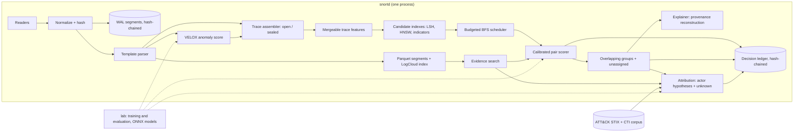

# snort: end-to-end build plan

Status: proposal. Scope: one process on one high-end workstation, demonstrating all six stages from `docs/sota/origin/md` end to end. Basis: the PDFs in `docs/sota` and the repositories in `docs/sota/repos.md`, all cloned and read for this plan. Nothing below has been run yet; every number marked "target" is to be confirmed or revised in Phase 0/1.

## 1. Decisions

1. **One Rust binary for the live path, Python for the lab.** `snortd` runs ingestion through attribution in a single process with internal threads. `lab/` (Python) does dataset conversion, training, baselines and evaluation. Models cross the boundary as ONNX. Reason: one process needs real parallelism, bounded memory and predictable latency; the reusable storage code (rottnest/LogCloud) is Rust; the research code is batch Python that would need rewriting for streaming regardless.
2. **Build the benchmark before the system.** No public dataset covers all six stages. The first deliverable is a replay harness with a three-level ground truth (incident ⊂ campaign ⊂ actor) assembled from DARPA TC, OpTC, ATLASv2 and CARBANAKv2 (PIDSMaker ground truth) and the Unveiling-CTAs command corpus.
3. **Simplest working version first, every stage.** Each stage ships with a baseline number. A more complex method replaces it only if it wins on the benchmark by a stated margin. This applies the main finding of *Sometimes Simpler is Better*.
4. **Template extraction happens once, at ingest, and serves two stages.** LogCloud-style template/variable splitting drives compression and substring search (stage 1). The same template IDs are the abstract action tokens for behavioural representation (stage 2).
5. **Trace representations are mergeable summaries.** ThreatTrace-style pooled embedding statistics, a MinHash sketch, a technique set and a timing histogram. Open traces update in O(1) per event. A learned Tracegram-style aggregator is a Phase 3 option, not a dependency.
6. **Candidates come from three indexes, unioned and capped.** A DynaHash-style MinHash/Hamming-LSH over behavioural shingles, an HNSW index over trace vectors, and an exact indicator index. BlockingPy is used offline to choose and tune ANN settings. Its connected-components step is never used online.
7. **Scoring follows Progressive Entity Matching.** Cheap weights, then BFS scheduling under a per-second budget, then a calibrated gradient-boosted pair model. The budget, not the input rate, bounds compute.
8. **Groups overlap, and "unassigned" is a valid state.** A trace belongs to zero, one or up to three groups. Merges and splits are recorded proposals, never transitive closure. Memberships express behavioural similarity, never identity.
9. **Attribution is a separate layer with an explicit "unknown actor" hypothesis.** An actor is declared only when calibrated evidence from at least two independent evidence classes clears a precision-tuned threshold. LLMs may draft explanations from cited evidence; they never set scores.
10. **Lineage is tamper-evident, not tamper-proof.** A BLAKE3 hash chain covers raw segments and every derived decision. Chain heads are signed with a key held outside the process and copied to an external append-only store, so rollback is detectable.

## 2. What we take from each source

Each source is marked adopt (use as-is), adapt (reimplement the method), or reject, with the reason found in the paper or code.

| Source | Stage | Use | Reason (from paper and code) |
|---|---|---|---|
| LogCloud (PVLDB 2025) | 1 | Adopt: the `logcloud` index in `marsupialtail/rottnest` (Apache-2.0, Rust) over local Parquet segments | Working implementation of LogGrep template/variable split plus FM-index substring search. The paper measured object storage, so local NVMe figures must be measured. |
| LogCrisp (ATC 2025) | 1 | Adapt the principle: pattern extraction at ingest, vectorized aggregation over columnar segments (DataFusion on Parquet) | No public code found. We do not claim its 3.8× ingestion figure. |
| ThreatTrace (CAiSE 2025) | 2, 5 | Adapt: trace compaction (merge repeats and frequent pairs), action-token embeddings, pooled `[count, mean, std, min, max]` trace vector | Code is R notebooks under GPL-2.0, batch only. Its fuzzy c-means memberships sum to 1, which forces every trace into some cluster. We replace it with possibilistic membership (§4.5). |
| Tracegram (USENIX Sec 2026) | 2 (Phase 3) | Adapt the formulation: per-instance encoder plus time-gap-aware attention pooling, attention weights as key-event evidence | The repo (MIT) uses a 24-layer linear-attention transformer over packet tokens and needs pcaps and a GPU: 29.8 ms per trace, 480 MB peak on an RTX 3080 Ti at batch 1. We use flow and event features instead of payload tokens. |
| DynaHash (Inf. Syst. 2026) | 3 | Adapt in Rust: bounded in-memory T (φ-prefix keys, w slots, random eviction), RocksDB DB for completeness, multi-probe, ranked retrieval | The reference code is about 350 lines of single-threaded Python with no license file, so it cannot be copied. Evaluated on bibliographic and voter strings at 0.05–0.1 s per query. Recall with T was just under 0.8 on 8M DBLP records. |
| BlockingPy (SoftwareX 2026) | 3, offline | Adopt (MIT) for ANN backend selection and blocking metrics (pairs completeness, reduction ratio) on replay corpora | Each `block()` call builds a fresh index and returns connected components of the kNN graph (`blocker.py`, igraph `components`). Transitive chaining is wrong where tools are shared. |
| Progressive Entity Matching (SIGMOD 2025) | 4 | Adapt: filtering → weighting → scheduling → matching, with BFS scheduling over top-k candidates (the paper's best nearest-neighbour workflow: BFS, k=5) | The paper evaluates static batch ordering and leaves matching and streaming out of scope. Budgeted streaming BFS is our adaptation and must be measured. The repo has no license and wraps pyJedAI; the scheduler is small enough to reimplement. |
| ORTHRUS (USENIX Sec 2025) | 5 | Adapt the reconstruction natively: 15-minute subgraph → DAG → backward/forward trace to entries and exits → criticality = mean of normalized out/in-degree and normalized anomaly → union of critical dependency graphs | The repo (Apache-2.0) is batch over Postgres, run on 1 TB RAM and an 80 GB GPU. Its false positives cluster in the one-hop neighbourhood of attack nodes. |
| Sometimes Simpler is Better / PIDSMaker (USENIX Sec 2025) | 5, evaluation | Adopt VELOX (word2vec node features, linear encoder, edge-type prediction loss) as the per-event anomaly score, trained in PIDSMaker (Apache-2.0) and exported to ONNX. Adopt its evaluation rules: node-level labels, ADP, at least 5 seeds, no tuning on test data, report cost. | VELOX runs on CPU, peaks at 5.7 MB RAM, and reports about 2,400 edges/s against a 1,832 edges/s dataset peak. ORTHRUS's ADP on E3-THEIA ranged from 1.00 to below 0.1 across seeds. |
| Unveiling Cyber Threat Actors (DTRAP 2025) | 6, ground truth | Adopt the dataset (CC BY 4.0) and the SCLC normalization idea. Retrain with beacon-grouped and time-forward splits and compare with TF-IDF plus logistic regression. | The shipped JSON has 137 actor keys, 94 with commands, grouped by beacon ID with timestamps and ATT&CK technique tags. The published split is random and stratified over 32-command windows (`data_prep/create_datasets.py`), so windows from one beacon land in both train and test. The reported F1 (95.11 / 93.60 / 88.95) is likely inflated. |
| AURA (arXiv 2025) | 6 | Adapt the pattern: retrieve structured TTP, tool and infrastructure evidence, then rank actors, with deterministic scoring. LLM only for written justification. | Best result was 63.33% top-1 (GPT-4o) on 30 reports with pass@3, from report text rather than telemetry. |
| TRACE (arXiv 2026) | 6, later | Phase 1 uses MITRE ATT&CK STIX directly as the actor graph. TRACE-style LLM extraction from reports comes later. | Entity extraction F1 is 81.24%, so extracted facts need review before they influence scores. |
| Honeypot hierarchical clustering (DTRAP 2026) | evaluation reference | Reference only | 176 patterns in 18 clusters. The preprint link in `repos.md` returns 403. |
| jev-ids | none | Reject for the core pipeline; can be plugged in later as an optional detector | Sends each flow to an external paid API and is benchmarked only on single NSL-KDD flows. |

Corrections to `docs/sota/origin/md`:
- *Sometimes Simpler is Better* reports its simple network leading on **eight of nine** DARPA datasets (abstract and conclusion), not five of seven.
- The LogCloud paper's artifact link (`rottnest-vldb-repro`) holds Rottnest benchmark scripts (C4, UUIDs, SIFT). The LogCloud index itself is in `marsupialtail/rottnest`, behind the `logcloud` feature.

## 3. System shape



**Threads.** One reader per source; a normalize/parse pool; trace assembler shards keyed by host; a feature/index worker; a scheduler/matcher pool; a single writer for group and attribution state, so group state needs no locks; a low-priority segment sealer; the API. Channels are bounded. Under overload the matching budget shrinks first.

**Ordering.** Each reader stamps a per-source sequence number before the parse pool. A per-host reorder buffer releases events to the assembler in (event time, source, sequence) order once a watermark passes (start with 5 s allowed lateness). Later arrivals are applied as versioned corrections to the affected trace, never silently reordered. This keeps shingles, inter-arrival features and process ancestry the same between live runs and replay.

**Loss guarantee.** No event is lost once it is appended to the WAL, because the WAL write precedes all other processing. Before that point the guarantee depends on the source. File tails and queue consumers resume from committed offsets, and agents must buffer until acknowledged, so bounded channels only add backpressure. Sources that cannot be paused (UDP syslog, NetFlow) get a dedicated receive thread with a large ring buffer. Drops are counted per source and reported, never hidden.

**Core records.**

| Record | Fields |
|---|---|
| Event | ts, host, subject entity, object entity, action, attributes, template_id + typed variables, event_hash |
| Entity | typed ID (process, file, socket/flow, user, host, domain), versioned on state change (required for DAG reconstruction) |
| Trace | anchor, window, member event hashes, state (open/sealed), features, version |
| Link | (trace, trace or group), calibrated probability, per-evidence-class contributions |
| Group | member traces with strength and state, evidence ledger, version |
| ActorHypothesis | group, actor or unknown, posterior, evidence classes used, decision |
| LedgerRecord | input hashes, model and parameter hashes, output hash, previous hash |

## 4. Stage designs

### 4.1 Ingest and retain searchable evidence (LogCloud, LogCrisp)

- Phase 1 inputs: DARPA CDM (via PIDSMaker converters), OpTC eCAR, Sysmon/EDR JSON, auditd, Zeek conn/dns/http/ssl, and CTA command JSON, all normalized to the Event schema.
- Raw bytes are appended to 256 MB zstd WAL segments with a per-record BLAKE3 hash. Each segment's Merkle root is chained to the previous root.
- An online template parser (Drain-style fixed-depth tree) runs at ingest. Its output is a template ID plus typed variables. Ingest-time template IDs are immutable and are the only IDs that features and indexes use. LogGrep-style refinement at seal time writes a separate `refined_template_id` column used only for compression and search. A refined vocabulary reaches the features only through a new model version, which re-featurizes recorded traces and is logged in the ledger.
- Segments are sealed hourly (or at 256 MB) into Parquet with dictionary-encoded `template_id`, typed variable columns and `event_hash`. A rottnest LogCloud index is built per sealed segment. DataFusion runs aggregation queries across segments.
- Hot state lives in RocksDB: entities, open traces, the DynaHash DB and indicator postings.
- Baselines to beat: zstd JSON plus ripgrep for search; DuckDB over untemplated Parquet for aggregation.

### 4.2 Represent each trace (ThreatTrace, Tracegram)

Tracegram's three trace-construction strategies, mapped to our modalities:
- **Host trace:** the process subtree under a session root (the first ancestor below a service boundary: sshd, winlogon, services, browser, office, script host, implant). Closed after 30 minutes idle or 24 hours; long-lived roots get rolling windows.
- **Command trace:** one shell session or one beacon ID.
- **Network trace:** a source host to a destination group, delimited by an idle gap, plus a 24-hour entity profile per host.

Relations between traces (spawned-by, same process, connected-to via host + 5-tuple + time) are kept as provenance edges for reconstruction.

Features, all mergeable and updated per event:
- **Token stream:** template IDs, SCLC-normalized commands, or (action, object class) tokens; ThreatTrace compaction applied at seal.
- **Shingle set:** 1–3-grams of tokens plus ATT&CK technique IDs from rules or tags, sketched with 128 MinHash functions.
- **Pooled vector:** `[log n, mean, std, min, max]` of 64-d word2vec token vectors trained offline per modality. 257 dimensions, L2-normalized, int8-quantized for indexing. Each modality's vectors live in their own embedding space, so they are indexed and compared only within that modality (§4.3).
- **Timing:** log2 inter-arrival histogram (8 bins), duration, burstiness.
- **Indicators:** file hashes, domains, IPs, ports, JA3/JA4, user agents, named pipes, service names, as exact keys. An IDF floor drops keys present in more than 0.1% of traces.
- **Anomaly:** maximum and mean VELOX loss over member events.

Phase 3 option: a MIL aggregator (instance MLP, time-gap encoding, gated attention pooling) trained with a supervised contrastive loss on campaign and session labels. Its attention weights become key-event evidence. It is adopted only if same-campaign recall@10 improves by at least 5 points over the pooled vector at no more than 2× the CPU cost.

### 4.3 Retrieve a small candidate set (DynaHash, BlockingPy)

- **LSH:** DynaHash Hamming-LSH on the MinHash vectors. Start from the paper's settings (θ=0.5, δ=0.1, k=6 for DB, φ=4 and w=500 for T, multi-probe ω=1) and re-tune k by sampled query time, as the paper does. T answers within the latency budget; DB is consulted for high-anomaly traces and audits.
- **ANN:** one HNSW index (usearch) per modality over pooled vectors: cosine, int8, M=32, ef_search=64, k=20, incremental inserts. Cross-modality candidates come only from modality-independent signals: provenance and causal joins, shared indicators, and technique sets. A learned cross-modal projection is a Phase 3 option under the same adoption rule as the MIL aggregator.
- **Indicators:** capped RocksDB posting lists.
- **Group prototypes:** a small separate HNSW per modality over group centroids, computed from that modality's members, k=10.
- **Union:** deduplicate and cap at 50 trace candidates plus 10 groups per query.
- **Offline:** BlockingPy runs the same corpora through faiss, hnsw, nnd and annoy to pick the backend and parameters by pairs completeness against reduction ratio.
- **Baselines:** indicators only; brute-force cosine on a sample.
- **Target:** neighbour recall ≥ 0.95, stratified by campaign size, at ≤ 50 candidates per trace. When a trace is queried, m same-campaign traces are already indexed. Its true neighbours are the min(50, m) of those closest in event time, and neighbour recall is the fraction of them that appear in its candidate set. Grouping needs a connected sparse set of true links, not all n(n−1)/2 pairs. A 50-candidate cap bounds full pairs completeness at 100/(n−1), so 0.95 is unreachable for campaigns of 107 or more traces even with perfect retrieval. Full pairs completeness is still reported, but only for BlockingPy comparisons.

### 4.4 Prioritize and score candidate relationships (Progressive Entity Matching)

- **Weighting:** cheap scores already computed: estimated Jaccard, cosine, indicator IDF sum, time proximity, same or adjacent host.
- **Scheduling:** BFS. Every queued trace gets its best candidate verified before any trace gets its second. Traces are ordered by anomaly score; this ordering is our extension and is compared against plain BFS and edge-centric ordering.
- **Matching:** a LightGBM pair model with about 25 features in six evidence classes:
  - behaviour sequence: banded normalized edit distance and LCS over compacted tokens, computed on at most the first and last 256 tokens of each trace, plus MinHash-estimated Jaccard for the remainder
  - technique set: IDF-weighted Jaccard
  - tooling: software and tool tokens
  - infrastructure: shared indicators
  - causality: a provenance path between the two traces within 15 minutes
  - timing

  Isotonic calibration on held-out pairs. Per-prediction TreeSHAP contributions are stored as evidence.
- **Budget:** the budget counts comparison cost, not pairs. Each pair is charged its estimated work (sequence cells plus a fixed model cost) against a per-second allowance, starting at about 20k typical pairs/s and adapted under load, and each pair also has a wall-clock cap (start at 2 ms). A pair that exceeds the cap is scored without its sequence features and flagged in its evidence.
- **Metrics:** the paper's progressive recall curve (true links found against comparisons spent) and calibration error.
- **Baseline:** a cosine threshold alone.

### 4.5 Group and explain related activity (soft clustering, ORTHRUS)

Membership:
- s(t, g) = mean of the top-3 calibrated link probabilities between trace t and members of group g, blended with prototype similarity.
- Keep up to three memberships with s ≥ τ_m (start at 0.5). Otherwise the trace stays unassigned; it remains indexed and can join a group later.
- Seed a new group when a pair has p ≥ τ_seed (start at 0.8) with at least two evidence classes and the two traces share no group yet. Either trace may already belong to other groups, subject to the three-membership cap, so a trace shared by two campaigns can seed the second.
- Membership states: proposed → supported → analyst-confirmed or analyst-rejected. Analyst membership decisions are stored as trace–group labels and used to calibrate s(t, g) and τ_m. They are never expanded into pair labels, because confirming a trace's membership in a non-transitive group does not make it a match with every member. The pair model is retrained only on pair-level labels: dataset ground truth plus explicit analyst same/different decisions on specific pairs.
- Two groups that share strong members produce an online merge proposal. A nightly offline audit runs Leiden on the calibrated link graph and proposes splits and merges. Every change is versioned in the ledger.

Explanation:
- Per membership: the top evidence contributions and the shared shingles and indicators, with pointers to event hashes.
- Per provenance member with anomalous nodes: ORTHRUS-style reconstruction (see §2), run on demand from an in-memory 48-hour temporal graph, with older edges read from RocksDB.
- Per group: a timeline across all members.

Metrics: extended BCubed precision and recall for overlapping clusters; fragmentation (groups per true campaign); time to correct membership; seed stability. Quality of attribution (QoA): nodes to inspect per attack, and ADP (area under the attack detection precision curve).

Baselines: connected components over shared indicators (the failure mode to quantify) and single-label HDBSCAN.

### 4.6 Attribute groups to known actors (behavioural models, AURA)

- **Knowledge base:** MITRE ATT&CK Enterprise STIX 2.1 (groups, campaigns, software, techniques, `uses` relations), versioned by hash. Optionally a local CTI report corpus searched with BM25.
- **Evidence classes** are defined by where the observation came from, not by which scorer read it:
  - **Execution content:** commands, process trees and file operations. Two scorers read this source:
    - IDF-weighted overlap of techniques and tools with each actor's known set;
    - for command traces, an open-set classifier with energy or max-probability rejection (start with TF-IDF n-grams plus logistic regression; compare with the CTA hybrid model).

    Both read the same observations, so they are stacked into one jointly calibrated score and count as one class.
  - **Infrastructure:** network indicators such as C2 domains, IPs, certificates and JA3/JA4 fingerprints, compared with actor-linked indicators, time-decayed and given low weight.
  - **Artifacts:** file hashes, malware family verdicts and named pipes or mutexes from file evidence.
- **Fusion:** a sum of calibrated log-likelihood ratios, one term per evidence class, scored against an explicit unknown-actor hypothesis with its own prior. Weights are fit on labelled data (CTA corpus, CARBANAKv2).
- **Decision rule** (posteriors are normalized over all actors plus unknown):
  - *attributed:* posterior ≥ 0.9, at least two independent evidence classes, and the top hypothesis stays first with posterior ≥ 0.5 when any one evidence class is removed (leave-one-class-out)
  - *candidates:* top posterior ≥ 0.3
  - *unresolved:* otherwise

  Thresholds are re-fit to reach ≥ 0.95 precision on time-forward held-out data, and coverage is reported alongside. Command-only traces, the CTA corpus included, supply a single evidence class, so they can reach at most *candidates*. The CTA corpus therefore evaluates ranking and calibration of the execution-content score. The *attributed* rule is evaluated on CARBANAKv2 and the composite stream, where infrastructure and artifact evidence also exist.
- Attribution is re-evaluated on every group change, and its history is kept.
- **LLM (optional, analyst-triggered):** drafts a justification from stored evidence records. Every cited evidence ID is checked to exist. It has no effect on scores.

## 5. Tamper-evident lineage

- **Raw:** per-event BLAKE3 hash, a Merkle root per segment, roots chained.
- **Derived:** every ledger record is `hash(inputs, model hash, params hash, output, prev)`. Models, the ATT&CK bundle and configuration are content-addressed.
- **Anchoring:** every N minutes the chain head is signed with an Ed25519 key held outside the process (TPM, HSM or a second machine). The signed head, its sequence number and the signature are also sent to an external append-only store: a second machine's write-once log, an RFC 3161 timestamp authority whose receipts are kept off the workstation, or a public transparency log. `verify` compares the local chain with the latest externally held head, which detects rollback, truncation and deleted suffixes. Without that external copy, an attacker who can rewrite local storage can roll back to an older validly signed head undetected. A workstation-only deployment therefore detects edits inside the chain, but not rollback.
- **Decision context:** each ledger record also stores the mutable context the decision depended on: candidate-set IDs and their weights, the group-state version, the index snapshot epoch, the scheduler round and the budget in force, and the IDs of the verified pairs.
- **Tools:** `snortd verify` recomputes the chains. `snortd replay <decision>` re-evaluates one decision from its recorded inputs and pinned model versions. Full-pipeline replay starts from a periodic state snapshot (indexes, groups, scheduler) and runs with a fixed budget instead of a load-adapted one. Both require fixed seeds, single-writer group state and the ordering rules in §3.

## 6. Workstation sizing and budgets

Reference machine: 32 cores, 256 GB ECC RAM, two 4 TB NVMe drives (one for WAL and hot state, one for sealed segments), and an optional 24–32 GB GPU used for training only. The live path is CPU-only.

| Item | Target |
|---|---|
| Sustained ingest (normalize + hash + WAL + parse) | 100k events/s (about 55× the DARPA E5-CADETS peak of 1,832 edges/s) |
| Event → trace feature update | p95 < 1 s |
| Sealed trace → memberships | p95 < 5 s at 10× replay |
| Pair verification budget | 20k/s |
| HNSW memory | about 0.5 KB per trace (257 B int8 vector + level-0 links), about 50 GB per 100M traces |
| Substring search over 30 days of segments | < 10 s |
| Event loss under 2× overload | none after WAL append; zero for offset-resumable sources; counted and reported for sources that cannot be paused (§3) |

## 7. Evaluation

### 7.1 Ground truth

Three levels: **incident** (one attack execution), **campaign** (the same operator and toolset across incidents or hosts), **actor** (a named group). Each dataset supplies some of them.

| Dataset | Modality | Levels | Use |
|---|---|---|---|
| DARPA TC E3 (CADETS, THEIA, CLEARSCOPE), E5 subsets | provenance | incident (ORTHRUS per-attack node CSVs in PIDSMaker); campaign (e.g. the Drakon implant across `Nginx_Backdoor_06/12/13` and `Firefox_Backdoor_Drakon`) | detection, reconstruction, grouping |
| DARPA E5-TRACE (710 GB), E5-FIVEDIRECTIONS (280 GB) | provenance | incident | volume and latency |
| OpTC h051, h201, h501 | Windows EDR | incident | enterprise background, scale |
| ATLASv2 (10 attacks), CARBANAKv2 EDR | Windows EDR | incident; actor emulation (Carbanak) | grouping, TTP attribution |
| Unveiling-CTAs corpus | commands | session (beacon), actor (94 with data) | behavioural attribution, open-set |
| DAPT2020, Tracegram datasets | network | trace, attack phase | network traces (Phase 3) |
| FedCSIS 2023 challenge (ThreatTrace data) | audit logs | trace label | representation sanity check |
| Composite stream | Windows EDR + commands | all three | end-to-end replay |

The composite stream uses OpTC benign days as background, with CTA beacon sessions injected as process-creation events under an implant process on chosen hosts, plus the ATLASv2 and CARBANAKv2 attacks. Timestamps and IDs are remapped. Actors held out of training are injected as "unknown". Injected activity is easier to separate than organic activity, so composite results are reported separately from single-dataset results.

### 7.2 Protocol

- Time-forward splits everywhere.
- Group-aware splits: no session, beacon or incident appears in both train and test.
- Open-set: 20% of actors held out entirely.
- At least 5 seeds for every learned component, reporting mean, min and max.
- Thresholds are fit on validation data, never on test data.
- Cost is reported throughout: CPU-hours, peak RAM, and disk per day of telemetry.
- First internal result: CTA attribution under the random split, the beacon-grouped split and the time-forward split, to quantify the leakage.

### 7.3 Metrics by stage

| Stage | Metric | Baseline |
|---|---|---|
| 1 Ingest | events/s, bytes per event on disk, search latency, aggregation latency | zstd + ripgrep; DuckDB |
| 2 Represent | same-campaign recall@10 | TF-IDF n-grams |
| 3 Retrieve | neighbour recall by campaign size against candidates per trace; reduction ratio; query latency | indicators only |
| 4 Score | progressive recall against comparisons spent; calibration error | cosine threshold |
| 5 Group/explain | extended BCubed P/R, fragmentation, time to correct membership; nodes to inspect per attack, ADP | indicator connected components; HDBSCAN |
| 6 Attribute | top-1/top-3 on known actors; unknown-actor AUROC; precision at coverage; calibration error | ATT&CK overlap only; TF-IDF + LR |
| End to end | time from first malicious event to correct group and to attribution; analyst items per true incident per day; CPU-hours per day | — |

### 7.4 Ablations

Remove one stage at a time (no LSH, no ANN, no indicator index, FIFO instead of the scheduler, cosine instead of the pair model, no explanation, single-source attribution) and report the end-to-end change. This table is the evidence that each research area earns its place.

## 8. Delivery plan

Durations assume 2–3 engineers.

**Phase 0: Benchmark (weeks 1–3)**
- Converters from DARPA E3-CADETS/THEIA, ATLASv2, CARBANAKv2, an OpTC sample and the CTA corpus into Event Parquet.
- Ground-truth manifests (incident, campaign, actor) and split files.
- Replay tool with deterministic ordering and 1×–100× rate control.
- Metric library and baselines: indicator-only grouping, TF-IDF retrieval, TF-IDF + LR attribution.
- CTA re-evaluation under grouped and time-forward splits.

Exit: one command produces the baseline report from the raw downloads.

**Phase 1: Walking skeleton (weeks 4–9)**
- `snortd` with the hash-chained WAL, a Drain parser, Parquet sealing and the rottnest LogCloud index.
- Trace assembler, mergeable features, plain MinHash LSH, HNSW and the indicator index.
- BFS scheduler and the LightGBM pair model via ONNX Runtime.
- Threshold memberships with the unassigned state; ATT&CK-overlap attribution with the unknown hypothesis.
- Ledger and `verify`.

Exit:
- E3-CADETS and the composite stream replay end to end at ≥ 10× real time.
- Every stage reports its metrics and matches or beats its baseline.
- `verify` passes.
- Results are stable across 5 seeds.

**Phase 2: Research fidelity (weeks 10–17)**
- Full DynaHash (T and DB, multi-probe, ranked retrieval), measured against plain LSH.
- VELOX scorer trained in PIDSMaker and driving priority; ORTHRUS-style reconstruction; QoA metrics on E3.
- Evidence search wired into matching and attribution.
- Open-set behavioural classifier; evidence fusion with calibrated weights.
- Offline group audit (Leiden) and merge/split proposals.
- Analyst API and a minimal UI for groups, evidence, decisions and feedback.

Exit:
- The §4 targets are met or revised with data.
- Reconstruction QoA is within 2× of ORTHRUS's published per-attack node counts on E3.
- An attribution report gives precision, coverage and unknown-actor rates.

**Phase 3: Learned representation, scale, ablations (weeks 18–24)**
- MIL aggregator, subject to the §4.2 adoption rule; network traces from Zeek, evaluated on DAPT2020.
- A 30-day-equivalent replay (E5-TRACE or OpTC volume) at the sustained target rate, plus an overload test.
- The full ablation table and a written evaluation report.

Exit: the end-to-end report is reproducible from a clean checkout on the reference workstation.

Only after Phase 3, decide whether to go multi-node (sharding by host, a queue in front, a shared index service), guided by the measured bottleneck.

## 9. Risks and open questions

- **Actor labels are scarce.** No public dataset joins telemetry to named actors at scale. Actor-level claims are limited to the CTA corpus (honeypots, mostly Cobalt Strike, 2020–2022) and the Carbanak emulation, so the default output is "unresolved".
- **Shared tooling.** Cobalt Strike and living-off-the-land binaries make cross-actor similarity common. Evidence-class independence and IDF weighting are the main defences. Measure the false-link rate between actors that use the same framework.
- **Seed instability.** ORTHRUS's ADP swung from 1.00 to below 0.1 across seeds on E3-THEIA. Use ensembles or seed averaging for production models, and report variance.
- **Sensor dependence.** Features learned on one capture mechanism may not transfer to another (e.g. CADETS vs THEIA). Train per sensor family and test across sensors.
- **Adversarial manipulation.** Mimicry, padding and timing manipulation are out of scope for Phases 1–3 and recorded as a known gap.
- **Drift.** Retrain VELOX and the pair model on a schedule. Watch calibration on analyst-confirmed decisions.
- **Licensing.** The DynaHash and PER repos have no license and ThreatTrace is GPL-2.0, so all three are reimplemented from the papers. Reusable as-is: rottnest, PIDSMaker and ORTHRUS (Apache-2.0); BlockingPy and Tracegram (MIT); the CTA data (CC BY 4.0, attribution required).
- **Name.** Snort is an established open-source IDS (Cisco). Consider renaming before anything public.
- **Open question:** which live telemetry the first deployment will see (Sysmon, auditd or an EDR vendor feed). This decides the parser and trace-anchor rules.

## 10. Repository layout

```
crates/
  core/       schema, IDs, hashing, ledger
  ingest/     readers, normalizer, WAL, template parser
  store/      RocksDB, Parquet segments, LogCloud (rottnest), DataFusion
  trace/      assembler, features, MinHash, pooled vectors
  retrieve/   DynaHash LSH, HNSW, indicator index
  match/      scheduler, ONNX pair scorer
  group/      memberships, proposals, audit hooks
  explain/    temporal provenance graph, reconstruction
  attrib/     ATT&CK knowledge base, scorers, fusion, decisions
  snortd/     single binary: pipeline, API, verify, replay
lab/
  convert/    DARPA CDM, OpTC, ATLASv2, CARBANAKv2, CTA → Event Parquet
  train/      word2vec, VELOX (PIDSMaker), pair model, actor models → ONNX
  eval/       metrics, splits, reports
  baselines/
bench/        dataset manifests, ground truth, replay specs, results
docs/
```
