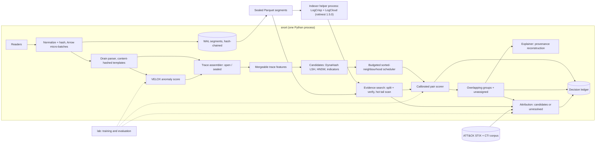

# snort: end-to-end build plan

Status: proposal, second version. It was rewritten after running three of the linked codebases on their own data:
- DynaHash and PER: `docs/assessment/dynahash-per.md`
- LogCloud: `docs/assessment/logcloud.md`

The other repositories have been read but not yet run; Phase 0 runs them. Numbers marked "target" are starting points, to be replaced by measured baselines.

Scope: one person, one workstation, one process, demonstrating all six stages from `docs/sota/origin/md` end to end on public data.

## 0. Definition of done

One command, `snort demo`, on the reference workstation and from a clean checkout:
1. Replays DARPA E3-CADETS, then the composite stream (§7.1), at 10× real time.
2. Produces groups of related traces with their evidence, ORTHRUS-style attack graphs, and for each group either ranked actor candidates or "unresolved".
3. Passes `snort verify` on the decision ledger.
4. Writes a metrics report comparing every stage with its baseline, plus the ablation table (§7.4).

Everything in this plan exists to make that command produce honest numbers.

## 1. Decisions

1. **Python first, in one process, with native libraries doing the heavy work.**
   - **Process:** the live path is one Python process. It uses Arrow and Polars micro-batches, RocksDB, usearch, LightGBM, ONNX Runtime and rottnest's Rust LogCloud.
   - **The one exception:** segment indexing runs in a helper process, because LogCrisp writes into its working directory, is not reentrant, and can crash on bad input.
   - **Porting:** a component moves to Rust only once profiling shows it is the bottleneck. The port is validated against the Python version on the same seeds.
   - **Why:** most of the linked code is Python or has Python bindings; the plan is sized for one person; and end-to-end evidence matters more than raw speed early on.
2. **Run every repository before relying on it.** Running DynaHash, PER and LogCloud found five classes of problem:
   - wrong formulas;
   - silent record loss;
   - missed search results;
   - crashes;
   - dependencies that no longer install or that change results.

   Each adopted repository is therefore reproduced on its own data, pinned, given regression tests, and written up in `docs/assessment/` before its numbers are trusted. Status is in §2.
3. **One dataset end to end before adding more.** E3-CADETS first (about 10 GB, three attacks, node-level ground truth). Then THEIA and CLEARSCOPE, then the composite stream.
4. **Go/no-go tests before building on assumptions.** Two tests run in Phase 0:
   - whether the trace definition keeps each attack in a few pure traces;
   - whether behavioural similarity separates traces from the same attack from unrelated ones.

   If either fails, the representation is redesigned before anything downstream is built.
5. **Simplest working version first, at every stage.** Each stage ships with a baseline number. A more complex method replaces it only if it wins on the benchmark by a stated margin, the main lesson of *Sometimes Simpler is Better*.
6. **Template IDs are content hashes.**
   - **Live features:** an online Drain parser supplies the tokens.
   - **Storage and search:** LogCrisp, via LogCloud, runs when a segment is sealed.
   - **Why hashing:** LogCrisp retrains its templates for every batch, so its IDs are not stable. Every template is identified by a hash of its normalized text, which makes both vocabularies stable and lets them be joined.
7. **Trace representations are mergeable summaries.** They combine ThreatTrace-style pooled embedding statistics, a MinHash sketch, a technique set and a timing histogram, so open traces update in O(1) per event.
8. **Candidates come from three indexes, unioned and capped:**
   - DynaHash LSH, using the authors' code with its defects fixed;
   - one HNSW index per modality;
   - an exact indicator index.

   BlockingPy is used offline only.
9. **Scoring follows Progressive Entity Matching, starting with sorted neighbourhood.** Trace linking is deduplication. In PER's own results sorted neighbourhood leads for deduplication at scale, so NN + BFS and Join are challengers. A calibrated gradient-boosted pair model makes the final match decision, and a compute budget bounds the work.
10. **Groups overlap, and "unassigned" is a valid state.** A trace belongs to zero to three groups. Merges and splits are recorded proposals, never transitive closure. Memberships express behavioural similarity, never identity.
11. **Attribution is a separate layer with an explicit "unknown actor" hypothesis.**
    - **Default output:** ranked candidates or "unresolved".
    - **The "attributed" level stays off** until its precision is measured across at least three held-out actors with independent evidence.
    - **Where that data comes from:** an emulation lab built in Phase 3 (§7.1), because no public dataset provides it.
    - **LLMs:** may draft explanations from cited evidence; they never set scores.
12. **Lineage is tamper-evident, not tamper-proof.** A BLAKE3 hash chain covers raw segments and every derived decision. Chain heads are signed with a key held outside the process; external copies of the heads, which make rollback detectable, are added once the core loop works.

## 2. What we keep from each repository

Status meanings:
- **Run:** reproduced on its own data here.
- **Read:** code inspected only.

| Repository | Keep | Leave | Status | Key findings |
|---|---|---|---|---|
| `marsupialtail/logcloud` (C++ LogCloud, published as `rottnest==1.0.4`) | The LogCrisp template trainer and compressor source (`vendored/LogCrisp_*`); the index format as the reference design | Its search and its `tail` mode | **Run** | 192 MB indexed in 25 s, about 21× smaller. At 961 MB, 22 of 40 exact-ID lookups returned nothing and some numeric queries crashed. Queries spanning a variable boundary (IP:port, template text) return nothing. `pip install rottnest` now installs 1.5.0, which lacks this code. |
| `marsupialtail/rottnest` (Rust LogCloud, `rottnest==1.5.0`) | The LogCloud index and search over Parquet segments we write ourselves, pinned with `getdaft==0.3.15` | — | **Run** | Same 961 MB: 40 of 40 exact lookups, about 1.3 s per query, about 4 MB/s indexing on 4 cores. Index is 229 MB on top of 105 MB Parquet (random IDs, close to the worst case). Shares the boundary-query problem; splitting the query and filtering for the full string fixed it in testing. Search breaks with current `getdaft`. |
| `dimkar121/DynaHash` | The code: MinHash, Hamming LSH, RocksDB store, multi-probe, ranked retrieval | — | **Run** | Recall reproduces (0.99, 0.96). About 1,000 inserts/s. Five defects to fix: hash-table count wrong for θ ≠ 0.5; same-key records collapse; T exists only in a demo script and keeps all vectors in RAM; multi-probe trees are static; input fixed to character 2-grams. Its RocksDB binding is missing from `requirements.txt`. |
| `JacobMaciejewski/PER-Design-Space-Exploration` | Runner and configs over pinned pyJedAI as the scheduling benchmark; sorted neighbourhood as the primary method | NN + BFS as the default | **Run** | Join reproduces exactly and sorted neighbourhood closely; PESM does not (unpinned pyJedAI). NN embedding took about 6 s per record on CPU. Shipped deduplication results favour sorted neighbourhood. |
| `ncn-foreigners/BlockingPy` | Offline ANN backend comparison and blocking metrics | The live path (rebuilds the index per call; merges by connected components) | Read | To run in Phase 0 |
| `janusza/ThreatTrace-Cyber-Attack-Detection` | Trace compaction, token embeddings, pooled `[count, mean, std, min, max]` vector; its FedCSIS data as a sanity check | Fuzzy c-means, which forces every trace into a cluster | Read | To run in Phase 0 (R notebooks) |
| `YuchenZhang-Academic/Tracegram` | The formulation: per-instance encoder plus time-aware attention pooling, as a Phase 3 option | The 24-layer packet transformer (needs pcaps and a GPU) | Read | 29.8 ms per trace on an RTX 3080 Ti (paper) |
| `ubc-provenance/orthrus` | The reconstruction algorithm, reimplemented on demand; per-attack ground truth via PIDSMaker | Postgres batch pipeline and the GNN | Read | Seed instability: ADP from 1.00 to below 0.1 on E3-THEIA (Bilot et al.) |
| `ubc-provenance/PIDSMaker` | VELOX training as the per-event anomaly score; dataset converters; node-level ground truth; evaluation rules (multiple seeds, ADP) | The other detectors | Read | To run in Phase 0 on E3-CADETS |
| `bogertaNET/Unveiling-CTAs` | The dataset: 94 actors, beacon sessions, timestamps, ATT&CK tags; the SCLC normalizer | Published scores (the split leaks) | Data inspected | Retrain on beacon-grouped and time-forward splits in Phase 0 |
| `jev-sec/jev-ids` | Nothing | Everything (per-flow paid API, NSL-KDD only) | Read | — |

Papers without separate code: AURA (adapt the retrieve-then-rank pattern with fixed scoring), TRACE (later: knowledge-graph extraction from reports), honeypot clustering (preprint link returns 403).

Corrections to `docs/sota/origin/md`:
- *Sometimes Simpler is Better* reports its simple network leading on **eight of nine** DARPA datasets, not five of seven.
- LogCloud's C++ implementation is `marsupialtail/logcloud`, and its Rust reimplementation is in `marsupialtail/rottnest`. `rottnest-vldb-repro` holds Rottnest's own benchmarks.
- LogCrisp's trainer and compressor code is public, vendored inside `marsupialtail/logcloud`.

## 3. System shape



**Concurrency.** Readers and native-library calls (Arrow, RocksDB, usearch, LightGBM, ONNX Runtime) run on threads that release the GIL. Group and attribution state has a single writer, so it needs no locks. Channels are bounded. Under overload the matching budget shrinks first.

**Ordering.** Each reader stamps a per-source sequence number. A per-host reorder buffer then releases events to the assembler in (event time, source, sequence) order once a watermark passes (start with 5 s allowed lateness). Later arrivals are applied as versioned corrections to the affected trace. This keeps shingles, inter-arrival features and process ancestry identical between live runs and replay.

**Loss guarantee.** No event is lost once it is appended to the WAL, which precedes all other processing. Before that point the guarantee depends on the source:
- File tails and queue consumers resume from committed offsets, and agents buffer until acknowledged.
- Sources that cannot be paused (UDP syslog, NetFlow) get a dedicated receive thread with a large ring buffer; their drops are counted and reported.

**Core records.**

| Record | Fields |
|---|---|
| Event | ts, host, source_id, source_seq, ingest_ts, subject entity, object entity, action, attributes, template_hash + typed variables, event_hash |
| Entity | typed ID (process, file, socket/flow, user, host, domain), versioned on state change |
| Trace | anchor, window, member event hashes, state (open/sealed), features, version |
| Link | (trace, trace or group), raw margin, calibrated probability, per-evidence-class contributions |
| Group | member traces with strength and state, evidence ledger, version |
| ActorHypothesis | group, actor or unknown, posterior, evidence classes used, decision |
| LedgerRecord | input hashes, model and parameter hashes, decision context, output hash, previous hash |

## 4. Stage designs

### 4.1 Ingest and retain searchable evidence (LogCloud, LogCrisp)

- **Inputs:** DARPA CDM (via PIDSMaker converters), OpTC eCAR, Sysmon/EDR JSON, auditd, Zeek, and CTA command JSON, all normalized to the Event schema in Arrow micro-batches.
- **WAL:** raw bytes go to 256 MB zstd WAL segments with a per-record BLAKE3 hash. Each envelope carries `source_id`, `source_seq` and `ingest_ts`. Each segment's Merkle root is chained to the previous one.
- **Live parsing:** an online Drain parser assigns templates. A template's ID is the hash of its normalized text. In live operation the shipped template set is frozen: unmatched lines create new templates, but existing ones are never generalized in place. Generalization happens only in a new, versioned vocabulary built offline.
- **Sealing:** each hour (or 256 MB) the WAL is written to Parquet that we control. Columns: `ts`, `host`, `source_id`, `source_seq`, `event_hash`, `template_hash`, typed variables and `raw`.
- **Indexing:** the helper process indexes the `raw` column of each sealed segment with rottnest 1.5.0 LogCloud. It works in a dedicated working directory, one segment at a time. LogCrisp's per-batch templates are hashed by their text and stored as `refined_template_hash`, for search only. A refined vocabulary reaches the features only through a new model version, which re-featurizes recorded traces and is logged in the ledger.
- **Search wrapper**, required because of the boundary-query problem:
  1. Split the query into variable-shaped parts.
  2. Search the most selective part; parts that hit the dictionary are tried last.
  3. Read only the returned row groups and keep lines containing the full query.
  4. Scan unsealed and not-yet-indexed segments directly with Polars or DuckDB.
- **Aggregation:** DuckDB over the Parquet segments.
- **Hot state:** RocksDB holds entities, open traces, the DynaHash DB and indicator postings.
- **Stage-1 bake-off (Phase 2):**
  - **Data:** at least 100 GB of real telemetry.
  - **Compared:** LogCloud + wrapper against zstd Parquet + DuckDB, and against ripgrep over zstd files.
  - **Measured:** recall against grep, latency, disk and indexing CPU.

  LogCloud stays only if it wins on latency at equal recall.

### 4.2 Represent each trace (ThreatTrace, Tracegram)

Trace construction, using Tracegram's three strategies:
- **Host trace:** the process subtree under a session root, meaning the first ancestor below a service boundary (sshd, winlogon, services, browser, office, script host, implant). Closed after 30 minutes idle or 24 hours; long-lived roots get rolling windows.
- **Command trace:** one shell session or beacon ID.
- **Network trace:** one source host to one destination group, split on idle gaps, plus a 24-hour profile per host. Phase 3.

The Phase 0 trace-boundary test (§8) checks this definition before features are built. Relations between traces (spawned-by, same process, connected-to) are kept as provenance edges.

Features, all mergeable:
- **Token stream:** template hashes, SCLC-normalized commands, or (action, object class) tokens. ThreatTrace compaction is applied at seal.
- **Shingle set:** 1–3-grams of tokens plus ATT&CK technique IDs, sketched with 128 MinHash functions.
- **Pooled vector:** `[log n, mean, std, min, max]` of 64-d subword token vectors (fastText-style, over template text).
  - The vectors are trained per modality and shipped with the parser vocabulary as one versioned artifact.
  - Unseen templates get vectors composed from their subwords, and the out-of-vocabulary rate is tracked as a drift signal.
  - 257 dimensions, int8-quantized, compared only within a modality.
- **Timing:** log2 inter-arrival histogram (8 bins), duration, burstiness.
- **Indicators:** file hashes, domains, IPs, ports, JA3/JA4, user agents, named pipes and service names, as exact keys.
  - Postings are always written, each capped to its most recent 10k traces.
  - At query time, keys present in more than max(100, 0.1% of indexed traces) traces are skipped as too common.
- **Anomaly:** maximum and mean VELOX loss over member events.

Phase 3 option: a MIL aggregator (instance MLP, time-gap encoding, gated attention pooling) trained with a supervised contrastive loss. It is adopted only if same-campaign recall@10 improves by at least 5 points over the pooled vector at no more than 2× the CPU cost.

### 4.3 Retrieve a small candidate set (DynaHash, BlockingPy)

- **LSH:** DynaHash, using the authors' code in `third_party/dynahash`, with the five defects fixed:
  - table count computed from θ;
  - record ID kept separate from blocking content;
  - token-set input instead of character 2-grams;
  - new bucket keys inserted into the multi-probe trees;
  - a bounded vector store.

  Each fix gets a regression test against the original on its bundled data. Start from the paper's settings (θ = 0.5, δ = 0.1, k = 6, φ = 4, w = 500, ω = 1) and re-tune k by sampled query time, as the paper does.
- **ANN:** one usearch HNSW index per modality (cosine, int8, M = 32, ef_search = 64, k = 20). Cross-modality candidates come only from provenance joins, shared indicators and technique sets.
- **Indicators:** capped RocksDB posting lists.
- **Group prototypes:** a separate HNSW per modality over group centroids, k = 10.
- **Union:** deduplicate, then cap at 50 trace candidates plus 10 groups.
- **Offline:** BlockingPy compares faiss, hnsw, nnd and annoy by pairs completeness against reduction ratio.
- **Target: neighbour recall ≥ 0.95, stratified by campaign size.**
  - **Definition:** a trace's true neighbours are the min(50, m) same-campaign traces already indexed and closest in event time. Neighbour recall is the fraction of them that appear in its candidate set.
  - **Why not pairs completeness:** a 50-candidate cap bounds it at 100/(n−1), so it is reported only for BlockingPy comparisons.

### 4.4 Prioritize and score candidate relationships (Progressive Entity Matching)

- **Scheduling: incremental sorted neighbourhood.**
  - Each sealed trace inserts its r rarest shingles as keys into an ordered RocksDB index (key = shingle ‖ seal sequence).
  - Its candidates are the w nearest entries on each side of each key (start r = 8, w = 10, from PER's best D2 configuration), weighted by shared windows.
  - Traces are served in anomaly order, one candidate per trace per round.
  - Challengers on the same budget: NN + BFS over the HNSW candidates (k = 5), and Join.
  - The PER runner on pinned pyJedAI provides the batch reference numbers.
- **Matching:** a LightGBM pair model with about 25 features in six evidence classes:
  - behaviour sequence: banded normalized edit distance and LCS on at most the first and last 256 compacted tokens, plus whole-trace MinHash Jaccard
  - technique set (IDF-weighted Jaccard)
  - tooling
  - infrastructure (shared indicators)
  - causality (a provenance path within 15 minutes)
  - timing

  Isotonic calibration on held-out pairs. The raw margin and its TreeSHAP contributions are stored, labelled as explaining the raw margin; decisions use the calibrated probability.
- **Budget:** counted in comparison cost, not pairs. Each pair is charged its sequence cells plus a fixed model cost, against a per-second allowance that starts at about 20k typical pairs/s and adapts under load. Each pair also has a 2 ms wall-clock cap; pairs over the cap are scored without sequence features and flagged.
- **Metrics:** progressive recall against comparisons spent; calibration error.
- **Baseline:** a cosine threshold alone.

### 4.5 Group and explain related activity (soft clustering, ORTHRUS)

Membership:
- s(t, g) = mean of the top-3 calibrated link probabilities between trace t and members of group g, blended with prototype similarity.
- Keep up to three memberships with s ≥ τ_m (start at 0.5). Otherwise the trace stays unassigned but remains indexed.
- Seed a group when a pair has p ≥ τ_seed (start at 0.8) with at least two evidence classes and the two traces share no group yet. Either trace may already belong to other groups.
- Membership states: proposed → supported → analyst-confirmed or analyst-rejected.
  - Analyst decisions are stored as trace–group labels, which calibrate s and τ_m. They are never expanded into pair labels.
  - The pair model trains only on pair-level labels.
- Online merge proposals arise when two groups share strong members. A nightly Leiden audit on the calibrated link graph proposes splits and merges. Every change is versioned in the ledger.

Explanation:
- Per membership: the top evidence contributions, plus shared shingles and indicators with event-hash pointers.
- Per provenance member with anomalous nodes, on demand from a 48-hour in-memory temporal graph (older edges from RocksDB): ORTHRUS reconstruction.
  1. Take a 15-minute subgraph and convert it to a DAG.
  2. Trace backward and forward to the attack's entry and exit nodes.
  3. Score each with criticality = mean of normalized out/in-degree and normalized anomaly.
  4. Report the union of the critical dependency graphs.
- Per group: a timeline across all members.

Metrics: extended BCubed precision and recall; fragmentation; time to correct membership; seed stability. Quality of attribution (QoA): nodes to inspect per attack, and ADP.

Baselines: connected components over shared indicators (the failure mode to quantify) and single-label HDBSCAN.

### 4.6 Attribute groups to known actors (behavioural models, AURA)

- **Knowledge base:** MITRE ATT&CK Enterprise STIX 2.1, versioned by hash. Optionally a local CTI report corpus searched with BM25.
- **Evidence classes** are defined by where the observation came from:
  - **Execution content** (commands, process trees, file operations): IDF-weighted technique and tool overlap, plus, for command traces, an open-set classifier. Start the classifier with TF-IDF + logistic regression and compare it with the CTA hybrid model. The two scorers are stacked into one jointly calibrated score, so they count as one class.
  - **Infrastructure** (C2 domains, IPs, certificates, JA3/JA4): time-decayed, low weight.
  - **Artifacts** (file hashes, malware family verdicts, named pipes and mutexes).
- **Fusion:** a sum of calibrated log-likelihood ratios, one term per class, scored against an explicit unknown-actor hypothesis with its own prior.
  - Execution-content weights are fit on the CTA corpus.
  - Infrastructure and artifact weights start as fixed, capped priors until the emulation lab supplies labelled data.
- **Decision rule** (posteriors normalized over all actors plus unknown):
  - *attributed:* posterior ≥ 0.9, at least two independent classes, and the top hypothesis stays first with posterior ≥ 0.5 when any one class is removed. Off by default until measured on at least three held-out actors with multi-class evidence.
  - *candidates:* top posterior ≥ 0.3.
  - *unresolved:* otherwise.

  Thresholds are re-fit to reach ≥ 0.95 precision on time-forward held-out data, with coverage reported. Command-only traces, including all of the CTA corpus, can reach at most *candidates*.
- **Re-evaluation:** attribution is recomputed on every group change, and its history is kept.
- **LLM (optional, analyst-triggered):** drafts a justification from stored evidence; every cited evidence ID is checked to exist; it does not affect scores.

## 5. Tamper-evident lineage

- **Raw:** a BLAKE3 hash per event, a Merkle root per segment, the roots chained.
- **Derived:** each ledger record is `hash(inputs, model hash, params hash, decision context, output, prev)`. Models, the ATT&CK bundle and configuration are content-addressed.
- **Decision context:**
  - candidate-set IDs and their weights;
  - the group-state version;
  - the index snapshot epoch;
  - the scheduler round and the budget in force;
  - the IDs of the verified pairs.
- **Signing:** every N minutes the chain head is signed with an Ed25519 key held outside the process.
- **External copies (after the core loop works):** each signed head is also sent to an external append-only store (a second machine's write-once log, an RFC 3161 timestamp authority, or a transparency log), so `verify` can detect rollback and truncation. Until then the ledger shows edits inside the chain, but not rollback.
- **Tools:**
  - `snort verify` recomputes the chains.
  - `snort replay <decision>` re-evaluates one decision from its recorded inputs.
  - Full-pipeline replay starts from a periodic state snapshot and runs with a fixed budget.

## 6. Workstation sizing and budgets

Reference machine: 32 cores, 256 GB ECC RAM, two 4 TB NVMe drives (one for WAL and hot state, one for sealed segments), and an optional 24–32 GB GPU for training only. The live path is CPU-only.

| Item | Target or measured figure |
|---|---|
| Sustained ingest (normalize + hash + WAL + parse), Python micro-batches | Phase 1 target 20k events/s (about 10× the DARPA E5-CADETS peak of 1,832 edges/s); 100k events/s only after profiling and porting the measured hot spots |
| Segment indexing | Measured about 4–5 MB/s per indexing job on 4 cores. 100 GB/day of logs averages 1.2 MB/s, so one job keeps up with headroom; the unindexed tail is scanned directly. |
| Event → trace feature update | p95 < 1 s |
| Sealed trace → memberships | p95 < 5 s at 10× replay |
| DynaHash insert | Measured about 1,000/s in memory for the original code. Enough for the E3 replay (traces, not events, are inserted); re-measured after the fixes. |
| HNSW memory | about 0.5 KB per trace, so about 50 GB per 100M traces |
| Event loss under 2× overload | none after WAL append; counted and reported for sources that cannot be paused |

## 7. Evaluation

### 7.1 Ground truth and datasets

Ground truth has three levels: **incident** (one attack execution), **campaign** (the same operator and toolset across incidents or hosts) and **actor** (a named group).

Datasets in the order they are used:

| Order | Dataset | Modality | Levels | Use |
|---|---|---|---|---|
| 1 | DARPA E3-CADETS | provenance | incident (ORTHRUS per-attack node CSVs); campaign (Drakon implant across `Nginx_Backdoor_06/12/13`) | go/no-go tests; full pipeline first |
| 2 | E3-THEIA, E3-CLEARSCOPE | provenance | incident; campaign (Drakon across hosts) | cross-sensor generalization, cross-host grouping |
| 3 | Unveiling-CTAs corpus | commands | session, actor (94) | behavioural attribution ranking, open-set |
| 4 | OpTC h051/h201/h501, ATLASv2, CARBANAKv2 | Windows EDR | incident; Carbanak emulation | composite background and attacks |
| 5 | Composite stream | Windows EDR + commands | all three | end-to-end replay |
| 6 | Emulation lab (built in Phase 3) | Sysmon, Zeek, file evidence | actor (4–6 emulated actors) | the only measurement of *attributed* |
| — | E5-TRACE (710 GB), E5-FIVEDIRECTIONS (280 GB) | provenance | incident | scale and latency (Phase 3) |
| — | DAPT2020, Tracegram datasets, FedCSIS 2023 | network, audit | trace | network traces and representation checks |

**Composite stream.**
- **Background:** OpTC benign days.
- **Injected activity:** CTA beacon sessions as process-creation events under an implant process, plus the ATLASv2 and CARBANAKv2 attacks, with timestamps and IDs remapped. Held-out actors are injected as "unknown".
- **Overlap scenarios:** constructed campaigns that share an implant build and C2 infrastructure, and one session carrying two campaigns, with multi-label manifests. Overlap metrics are reported only on these.

Injected activity is easier to separate than organic activity, so composite results are reported separately.

**Emulation lab.**
- **Setup:** a few Windows and Linux VMs with Sysmon and Zeek, running 4–6 public adversary-emulation plans (for example from the MITRE CTID Adversary Emulation Library, run with Caldera or Atomic Red Team).
- **Runs:** several times each, with varied infrastructure and scripted benign activity alongside.
- **What it gives:** the only practical source of several actors with execution, infrastructure and artifact evidence.
- **Caveat:** an emulation plan reproduces an actor's documented techniques, not the actor itself. Results measure retrieval of documented behaviour and are reported that way.

### 7.2 Protocol

- **Splits:**
  - Time-forward everywhere.
  - Group-aware: no session, beacon or incident appears in both train and test.
  - Open-set: 20% of actors are held out, split into disjoint validation and test sets. Every attribution input is built per split, removing held-out actors from classifier training, the ATT&CK snapshot, the CTI corpus and indicator lists.
- **Seeds:** at least 5 for every learned component, reporting mean, min and max.
- **Thresholds:** fit on validation data, never on test.
- **Targets:** relative to measured baselines (for example "beat indicator-only grouping on BCubed F1 by 0.10"), set once Phase 0 baselines exist. The fixed numbers in §4 are starting points.
- **Cost:** CPU-hours, peak RAM, and disk per day of telemetry, reported throughout.

### 7.3 Metrics by stage

| Stage | Metric | Baseline |
|---|---|---|
| 1 Ingest | events/s, bytes per event, search recall against grep, search and aggregation latency | zstd + ripgrep; DuckDB over Parquet |
| 2 Represent | same-campaign recall@10; separability AUC (go/no-go) | TF-IDF n-grams |
| 3 Retrieve | neighbour recall by campaign size; reduction ratio; latency | indicators only |
| 4 Score | progressive recall against comparisons; calibration error | cosine threshold |
| 5 Group/explain | extended BCubed P/R, fragmentation, time to correct membership; nodes to inspect per attack, ADP | indicator connected components; HDBSCAN |
| 6 Attribute | top-1/top-3; unknown-actor AUROC; precision at coverage; calibration error | ATT&CK overlap only; TF-IDF + LR |
| End to end | time to correct group and to attribution; analyst items per true incident per day; CPU-hours per day | — |

### 7.4 Ablations

Remove one stage at a time and report the end-to-end change:
- no LSH;
- no ANN;
- no indicator index;
- FIFO instead of the scheduler;
- cosine instead of the pair model;
- no explanation;
- single-source attribution.

This table is the evidence that each research area earns its place.

## 8. Delivery plan (one person)

**Phase 0: Assess and test the premises (weeks 1–3)**
- Finish the assessments, one note each in `docs/assessment/`:
  - VELOX in PIDSMaker on E3-CADETS: reproduce ADP over 3 seeds and measure CPU inference speed;
  - ORTHRUS ground truth loaded and checked;
  - the ThreatTrace notebooks on their FedCSIS data;
  - BlockingPy on a trace-shaped corpus;
  - the CTA classifier under random, beacon-grouped and time-forward splits.
- E3-CADETS converter to Event Parquet, plus ground-truth manifests and split files.
- `third_party/` with pinned versions and fixes:
  - DynaHash, with the five fixes and regression tests;
  - PER runner + pyJedAI, pinned;
  - rottnest 1.5.0 + `getdaft==0.3.15`.
- **Go/no-go 1, trace boundaries:** on E3-CADETS, how many traces each attack's labelled nodes fall into, and what share of each such trace is attack activity. Pass: each attack falls mostly into 3 or fewer traces, and those traces are mostly attack activity. Exact cut-offs are fixed before looking at the results.
- **Go/no-go 2, separability:** the distributions of MinHash Jaccard and pooled-vector cosine for same-attack trace pairs against random pairs. Pass: AUC ≥ 0.8 for at least one representation.

Exit: both tests decided with numbers. If a test fails, Phase 1 starts with a redesign of trace boundaries or features.

**Phase 1: E3-CADETS end to end (weeks 4–9)**
- Ingest → WAL → Parquet → LogCloud helper with the search wrapper → traces → features.
- DynaHash, HNSW and the indicator index.
- Sorted-neighbourhood scheduler; LightGBM pair model.
- Groups, ORTHRUS reconstruction, ledger and `verify`.
- Report with baselines and 5 seeds.

Exit: `snort demo --dataset e3-cadets` produces the report; every stage beats its baseline or the report says why not.

**Phase 2: Widen and attribute (weeks 10–15)**
- THEIA and CLEARSCOPE (cross-sensor, cross-host campaign).
- The composite stream with overlap scenarios.
- Attribution on the CTA corpus (candidates and unresolved, open-set).
- The stage-1 bake-off at ≥ 100 GB.
- Profiling, with Rust ports only where measured.

Exit: the composite run in the report, with attribution ranking and unknown-actor metrics.

**Phase 3: Emulation lab, scale, ablations (weeks 16–24)**
- Emulation lab data, used to measure *attributed* and decide whether it is turned on.
- MIL aggregator under its adoption rule.
- Network traces.
- A scale replay (E5-TRACE or OpTC volume).
- The full ablation table and a written evaluation.

Exit: §0 holds.

Deferred until the core loop works: an analyst UI beyond the static report, LLM explanations, external copies of chain heads, multi-node.

## 9. Risks and open questions

- **Actor labels are scarce.** Public data supports actor ranking only for command traces (CTA) and a single emulated actor (Carbanak). *Attributed* depends on the emulation lab, which measures documented behaviour, not real actors.
- **Shared tooling.** Cobalt Strike and living-off-the-land binaries make cross-actor similarity common. Measure the false-link rate between actors that use the same framework.
- **Seed instability.** Learned detectors vary widely across seeds (ORTHRUS ADP 1.00 to below 0.1). Report variance; use seed averaging.
- **Sensor dependence.** Train per sensor family and test across sensors.
- **Research code reliability.** Every artifact run so far had at least one defect that would have corrupted results:
  - wrong formulas;
  - silent record loss;
  - missed search results;
  - crashes;
  - broken installs.

  The remaining artifacts are assessed the same way in Phase 0.
- **LogCloud fit.** Boundary-crossing queries need the wrapper. Templates are per-batch. The newest data must be scanned directly. On local disk, plain scans may be as fast at workstation scale: the Phase 2 bake-off decides.
- **Python throughput.** The 100k events/s target may need Rust ports of normalization and hashing. Decide after profiling, not before.
- **Adversarial manipulation.** Out of scope for Phases 1–3 and recorded as a known gap.
- **Name.** Snort is an established open-source IDS (Cisco). Consider renaming before anything public.
- **Open question:** which live telemetry the first deployment will see (Sysmon, auditd or an EDR vendor feed). This decides the parser and trace-anchor rules.

## 10. Repository layout

```
snort/          Python package, one process
  ingest/       readers, normalizer, WAL, Drain parser
  store/        Parquet segments, LogCloud helper and search wrapper, DuckDB, RocksDB
  trace/        assembler, features, MinHash, pooled vectors
  retrieve/     DynaHash adapter, HNSW, indicator index
  match/        sorted-neighbourhood scheduler, pair scorer
  group/        memberships, proposals, audit
  explain/      temporal provenance graph, reconstruction
  attrib/       ATT&CK knowledge base, scorers, fusion, decisions
  ledger/       hash chain, verify, replay
  cli.py        snort demo / verify / replay
third_party/    pinned, patched copies: dynahash, per-runner (plus pinned pyjedai, rottnest, getdaft)
lab/
  convert/      DARPA CDM, OpTC, ATLASv2, CARBANAKv2, CTA → Event Parquet
  train/        token embeddings, VELOX (PIDSMaker), pair model, actor models
  eval/         metrics, splits, reports, go/no-go tests
  emulation/    lab build scripts and run manifests (Phase 3)
bench/          dataset manifests, ground truth, replay specs, results
docs/
  assessment/   one note per repository, with reproduction commands
```
