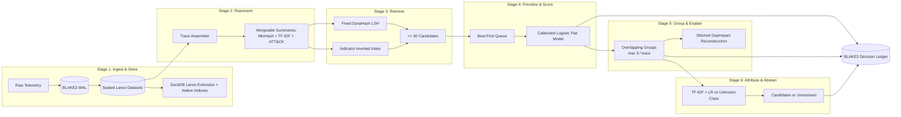
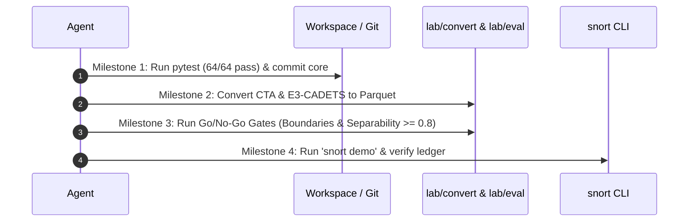

# snort: Agent Execution Plan for Working Prototype (Version 1)

> **Execution Directive for Autonomous Agents:**  
> This document is the definitive master plan for implementing, verifying, and running the `snort` trace grouping and attribution prototype in the shortest possible time.  
> Agents working on this codebase must follow the explicit milestone sequence and guardrails detailed below. Do not pursue open-ended academic investigations, complex neural retraining, or multi-process daemon refactors.

---

## 0. Executive Target & Definition of Done

**Goal:** Deliver a working, single-process prototype running on public provenance (DARPA E3-CADETS) and attacker command telemetry (Unveiling-CTAs) that demonstrates all six stages end to end.

**Definition of Done:** Running `snort demo` from a clean checkout must:
1. Replay DARPA E3-CADETS and CTA sessions through the 6-stage pipeline.
2. Answer evidence searches over retained Parquet segments (verified against DuckDB/grep).
3. Form overlapping trace groups (max 3 memberships per trace, leaving ambiguous traces unassigned).
4. Provide stitched DepImpact provenance reconstructions for E3-CADETS attack groups.
5. Rank actor candidates for known CTA sessions while strictly resolving held-out actors and labelless E3 groups to **`unresolved`**.
6. Pass cryptographic verification on the BLAKE3 decision ledger via `snort verify-ledger`.
7. Write a verified metrics report ([`bench/results/demo/metrics.md`](file:///Users/mac/snort/bench/results/demo/metrics.md)) including the 3 core ablations (no-LSH, FIFO, cosine).

---

## 1. Strict Agent Guardrails (Invariants)

To ensure rapid delivery without regressions or rabbit holes, agents must strictly uphold these rules:

1. **NO Deep Learning or GNN Retraining:**
   - Do **NOT** attempt to train or tune GNNs (ORTHRUS), temporal transformers (Tracegram), or VELOX on CPU.
   - Use proven, fast, CPU-friendly primitives: TF-IDF n-grams, 128-d MinHash shingles, and scikit-learn Logistic Regression.
2. **NO Multi-Process Daemons:**
   - The live prototype runs synchronously in a single Python process. Keep concurrency bounded to GIL-releasing native libraries (Arrow, Polars, DuckDB, RocksDB).
3. **NO Transitive Closure:**
   - Do **NOT** use `connected_components` to build groups. Transitive closure merges distinct actors (proven to drop purity from 86% to 66% and merge 7 actors).
   - Groups are soft, overlapping, and capped at 3 memberships per trace.
4. **NO Forced 100% Attribution (Enforce the Unknown Class):**
   - Held-out threat actors and provenance-only groups have no ground-truth actor and **must** resolve to `unresolved`.
   - Command-only traces cannot exceed `candidates`. Never force an artificial 1.0 attribution score.
5. **NO Unpinned Dependencies:**
   - Always run within `.venv/`. Vendored upstream code lives in [`third_party/`](file:///Users/mac/snort/third_party/) with unit-tested drop-in fixes.

---

## 2. Six-Stage Architecture & Data Flow



### Stage Contracts:

| Stage | Input | Primary Implementation | Output | Fast Baseline |
| :--- | :--- | :--- | :--- | :--- |
| **1. Ingest & Store** | Raw JSON / CSV / CDM | [`snort.ingest.wal.WalWriter`](file:///Users/mac/snort/snort/ingest/wal.py), [`snort.store.seal`](file:///Users/mac/snort/snort/store/seal.py), [`snort.store.search`](file:///Users/mac/snort/snort/store/search.py) | Sealed Lance + BLAKE3 data hashes | Dynamic DuckDB Unified View (`UNION ALL` over Lance segments & WAL buffer) + Hybrid Lance BM25 scoring |
| **2. Represent** | Normalized events | [`snort.trace.assembler`](file:///Users/mac/snort/snort/trace/assembler.py), [`snort.trace.features`](file:///Users/mac/snort/snort/trace/features.py) | Process subtrees / beacon sessions with MinHash (128) + TF-IDF | Token n-gram counts |
| **3. Retrieve** | Trace features | [`snort.retrieve.minhash_lsh`](file:///Users/mac/snort/snort/retrieve/minhash_lsh.py), [`third_party.dynahash`](file:///Users/mac/snort/third_party/dynahash/dynahash.py) | Capped candidates ($\le 50$) | Exact indicator matches |
| **4. Prioritize & Score** | Candidate pairs | [`snort.match.queue`](file:///Users/mac/snort/snort/match/queue.py), [`snort.match.pair_model`](file:///Users/mac/snort/snort/match/pair_model.py) | Calibrated link probabilities $P(\text{same-group})$ | Cosine threshold |
| **5. Group & Explain** | Scored links | [`snort.grouping`](file:///Users/mac/snort/snort/grouping.py), DepImpact reconstruction | Overlapping groups + attack DAGs | Indicator components |
| **6. Attribute** | Group commands + ATT&CK | [`snort.attrib.fusion`](file:///Users/mac/snort/snort/attrib/fusion.py) | Ranked candidates or `unresolved` | ATT&CK overlap |
| **Lineage** | Any decision | [`snort.ledger.chain.Ledger`](file:///Users/mac/snort/snort/ledger/chain.py) | Cryptographic append-only chain | Plain JSONL log |

> [!NOTE]
> **Storage & Search Engine Lessons from `jevalin-web`:**
> 1. **Dynamic DuckDB Unified View:** Evidence searches query all sealed `.lance` segments and the in-memory unsealed WAL buffer in a single vectorized `UNION ALL` query, pushing down predicates and limits across both live stream and cold datasets.
> 2. **Hybrid BM25 Scoring:** Free-text searches leverage Lance's native full-text inverted index (`raw_idx`) to compute Tantivy BM25 relevance scores (`_score`) combined with exact boolean filter expressions (`filter_expr`).
> 3. **Guard Against Constant Numeric Columns:** Lance serialization in [`lab/convert/event_schema.py`](file:///Users/mac/snort/lab/convert/event_schema.py) guards against synthetic constant numeric columns (which trigger DuckDB Lance reader RLE page decode bugs) by casting non-schema constant numerics to strings.


---

## 3. Fast-Track Agent Execution Roadmap

Agents should execute and verify the prototype using the following four sequential milestones:



---

### Milestone 1: Core Engine Freeze & Test Suite Verification
**Objective:** Confirm that the existing core implementation is fully functional and tracked in git.

1. **Verify Test Suite:**
   ```bash
   .venv/bin/pytest
   ```
   *Expected:* `64 passed` in ~9 seconds across all test files in [`tests/`](file:///Users/mac/snort/tests/).
2. **Verify Vendored DynaHash Regression Suite:**
   ```bash
   .venv/bin/python -m unittest discover -s third_party/dynahash/tests -t third_party/dynahash
   ```
   *Expected:* `23 passed` confirming that table count ($p = \theta$), key collision, and unbounded memory bugs are resolved.
3. **Commit Clean State:**
   Ensure `snort/`, `tests/`, `lab/`, `third_party/`, `pyproject.toml`, and `requirements.txt` are tracked on `main`.

---

### Milestone 2: Data Bridge & Conversion
**Objective:** Ingest real-world telemetry into standardized Event and Trace Parquet segments.

1. **Convert Unveiling-CTAs Corpus:**
   ```bash
   .venv/bin/python -m lab.convert.cta \
     --json <path_to_data_with_sclc.json> \
     --out-dir data/cta_converted
   ```
   *Outputs:* `data/cta_converted/events.parquet`, `traces.parquet`, `splits.json`, `manifest.json`.
   *Validation:* `splits.json` must contain a time-forward 70/15/15 split with 20% held-out actors.

2. **Convert DARPA E3-CADETS Provenance:**
   ```bash
   .venv/bin/python -m lab.convert.e3_cadets \
     --edges <path_to_cadets_edges.csv> \
     --ground-truth-dir <path_to_orthrus_gt_dir> \
     --out-dir data/e3_converted
   ```
   *Outputs:* `data/e3_converted/events.parquet`, `traces.parquet`, `manifest.json`.
   *Validation:* Ground-truth attack nodes for Drakon Nginx backdoor incidents are present in `manifest.json`.

---

### Milestone 3: Automated Go/No-Go Gates
**Objective:** Verify trace boundaries and separability on real data before running full pipeline grouping.

1. **Gate 1: Trace Boundaries ([`lab/eval/gono_go1_boundaries.py`](file:///Users/mac/snort/lab/eval/gono_go1_boundaries.py))**
   ```bash
   .venv/bin/python -m lab.eval.gono_go1_boundaries \
     --events data/e3_converted/events.parquet \
     --traces data/e3_converted/traces.parquet \
     --manifest data/e3_converted/manifest.json \
     --out bench/results/gono_go1.json
   ```
   *Pass Threshold:* Verdict = `GO` (Top-3 trace coverage $\ge 0.8$, purity $\ge 0.5$).

2. **Gate 2: Trace Separability ([`lab/eval/gono_go2_separability.py`](file:///Users/mac/snort/lab/eval/gono_go2_separability.py))**
   ```bash
   .venv/bin/python -m lab.eval.gono_go2_separability \
     --traces data/e3_converted/traces.parquet \
     --manifest data/e3_converted/manifest.json \
     --out bench/results/gono_go2.json
   ```
   *Pass Threshold:* Verdict = `GO` (Max of MinHash Jaccard AUC or TF-IDF Cosine AUC $\ge 0.8$).

---

### Milestone 4: End-to-End Pipeline Execution & Ledger Verification
**Objective:** Run the full 6-stage pipeline, verify the cryptographic ledger, and output the ablation report.

1. **Run the Demonstration Pipeline:**
   ```bash
   .venv/bin/python -m snort.cli demo --out bench/results/demo --seeds 5 --budget 400
   ```
   *Expected Output:*
   - Ingests traces, forms overlapping groups, extracts provenance subgraphs, scores attribution.
   - Outputs: `bench/results/demo/ledger.jsonl`, `summary.json`, and `metrics.md`.

2. **Verify Cryptographic Ledger:**
   ```bash
   .venv/bin/python -m snort.cli verify-ledger bench/results/demo/ledger.jsonl
   ```
   *Expected Output:* `OK`. (Recomputes BLAKE3 chain roots across all raw inputs and derived decisions).

3. **Verify Metrics & Ablations:**
   Inspect [`bench/results/demo/metrics.md`](file:///Users/mac/snort/bench/results/demo/metrics.md):
   - Known CTA sessions produce valid top-1/top-3 candidates.
   - Held-out CTA sessions and E3 provenance groups evaluate to **`unresolved`**.
   - Ablation deltas (full pipeline vs. no-LSH vs. FIFO vs. cosine) are printed.

---

## 4. Primary Data Schemas & Interfaces

All stages adhere to the immutable record contracts in [`lab/convert/event_schema.py`](file:///Users/mac/snort/lab/convert/event_schema.py) and [`snort/`](file:///Users/mac/snort/snort/):

- **Event Record:**
  - `event_hash` (str, BLAKE3 hex)
  - `ts` (int, nanoseconds UTC)
  - `host` (str)
  - `source_id` (str)
  - `source_seq` (int)
  - `subject` (str, actor/process ID)
  - `object` (str, file/IP/command)
  - `action` (str, EXEC/READ/WRITE/CONNECT)
  - `raw_text` (str, command string or log line)
- **Trace Record:**
  - `trace_id` (str)
  - `anchor` (str, session or process root)
  - `t_start`, `t_end` (int)
  - `member_count` (int)
  - `minhash` (list[int], 128 hashes)
  - `techniques` (list[str], ATT&CK IDs)
  - `indicators` (list[str], exact tokens)
- **Decision Ledger Record:**
  - `index` (int, sequential)
  - `stage` (str: `ingest` | `links` | `group` | `attribution`)
  - `input_hashes` (list[str])
  - `context` (dict)
  - `output` (dict)
  - `prev_hash` (str, 32-byte BLAKE3 hex)
  - `record_hash` (str, 32-byte BLAKE3 hex)

---

## 5. Verification Commands Quick Reference

| Action | Command | Expected Result |
| :--- | :--- | :--- |
| **Run Core Tests** | `.venv/bin/pytest` | `67 passed` |
| **Run DynaHash Tests** | `.venv/bin/python -m unittest discover -s third_party/dynahash/tests -t third_party/dynahash` | `23 passed` |
| **Run End-to-End Demo** | `.venv/bin/python -m snort.cli demo --out bench/results/demo` | `verify: OK`, writes `metrics.md` |
| **Verify Ledger** | `.venv/bin/python -m snort.cli verify-ledger bench/results/demo/ledger.jsonl` | `OK` |
| **Unified Search** | `.venv/bin/python -m snort.cli search "query" --sealed-dir sealed/ --wal-dir wal/` | Fast SIMD scan across sealed + WAL |
| **Hybrid BM25 Search** | `.venv/bin/python -m snort.cli search "query" --sealed-dir sealed/ --bm25 --filter "host = 'h1'"` | BM25 scored & ranked matches |
