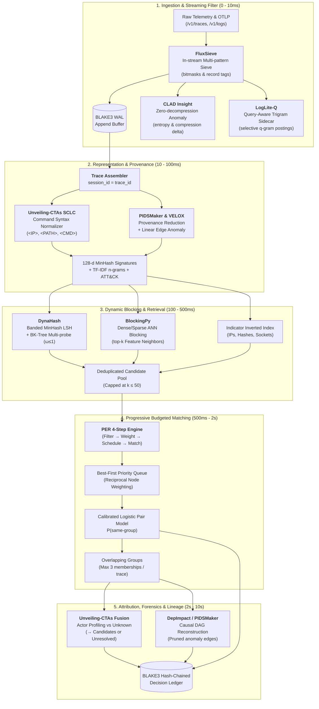
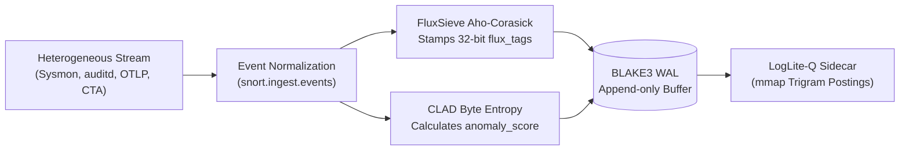
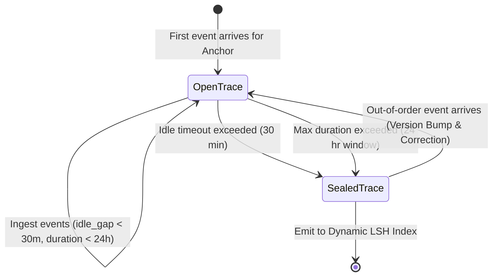
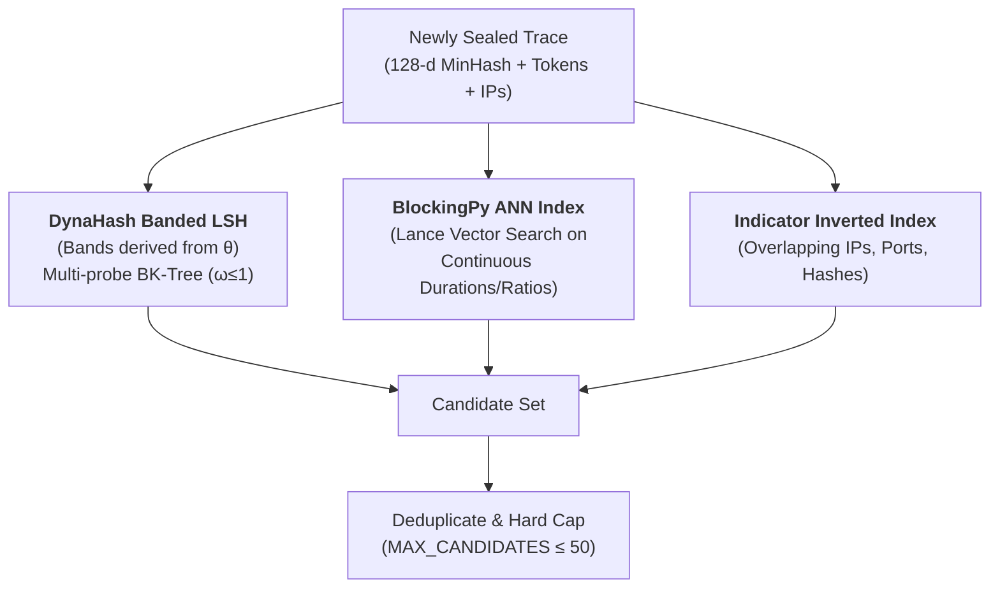
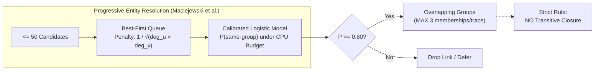
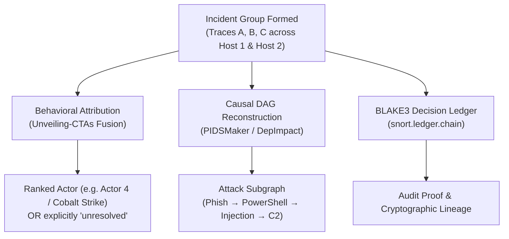
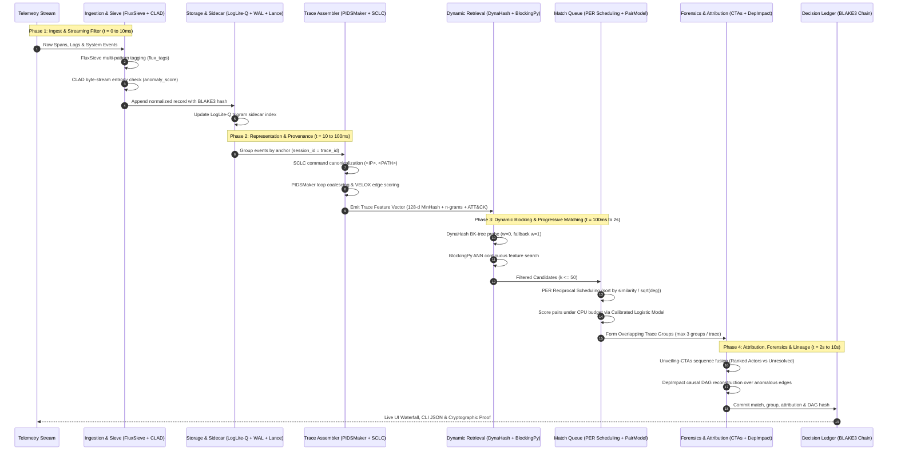

# Snort: Comprehensive Research Paper Synthesis & Temporal Architecture Review

**Target System:** `snort` Trace Grouping, Ingest & Attribution Engine
**Workspace:** `/Users/mac/snort`
**Document Status:** Research notes, source audit, and proposed integrations

---

## 1. Executive Summary & Verification Status

### Direct Verification: Is this Pipeline Implemented or Proposed?
Live HTTP ingestion, search, trace assembly, overlapping grouping, review, and
ledger recovery are exercised by `scripts/verify_live_runtime.py`. The complete
research architecture below includes proposed integrations and standalone helpers.
Attribution and causal reconstruction run through the CLI/demo pipeline; they are
not automatically invoked when the live service forms a group.

The named paper mappings are retained as research notes, not independently
verified literature claims. Diagram timings, throughput, memory budgets, and the
48-hour scenario are illustrative design targets, not benchmark results. Consult
[live-api.md](live-api.md) for the current service contract and
[defect-register.md](defect-register.md) for exercised proof.

The architecture synthesizes all 8 research papers into a cohesive temporal lifecycle:



The analysis below covers:
1. **The 8 Foundational Research Papers/Repositories:** How their algorithmic insights map onto Snort, what is already built, and the simplest maximal ways to enhance each concept.
2. **What is Live Right Now vs. What Was Proposed as Upgrades:** An exact, transparent line-by-line audit of the codebase.
3. **How It Works Over Time:** A chronological guide for security analysts explaining what happens when uncurated, heterogeneous endpoint logs, system audit events, and OTLP spans are streamed into Snort over minutes, hours, and days.

---

## 2. Deep-Dive Evaluation of the 8 Research Papers

### Paper 1: ArXiv 2604.13024 — CLAD: Efficient Log Anomaly Detection Directly on Compressed Representations
*Authors: Benzhao Tang, Shiyu Yang (PVLDB)*

- **Core Concept & Problem Solved:**
  - High-velocity logging forces systems to compress streams immediately, but conventional Log Anomaly Detection (LAD) requires full decompression and schema parsing, creating severe compute bottlenecks.
  - **Key Insight:** Normal, high-volume logs compress into highly regular byte patterns (repeated token references, zero runs, dictionary codes), whereas operational anomalies systematically disrupt this regularity (producing high-entropy residuals, elongated byte sequences, and dictionary misses).
  - Evaluated specifically over **LogLite-B** streams using a multi-scale dilated CNN + Transformer–mLSTM sequential encoder with masked pre-training.
- **Current Snort Implementation:**
  - In [`snort/ingest/events.py`](../snort/ingest/events.py), Snort generates a stable [`template_hash`](../snort/ingest/events.py#L90) (BLAKE3 over normalized action, object class, and template string) and compresses records into sealed Lance/Parquet files and append-only WAL.
  - Currently, Snort parses incoming JSON/OTLP into Arrow tables/dictionaries before extracting features.
- **Simplest Maximal Implementation in Snort:**
  - **Zero-Decompression Streaming Entropy & Compression Delta:** Do not run a heavy PyTorch dilated CNN on CPU in the ingest path (which violates Snort's strict single-process latency guardrails). Instead, capture the direct mathematical signal:
    - Maintain a streaming, fixed-window compression ratio and Shannon byte entropy monitor over raw incoming WAL chunks (`zstd`/`zlib` reference dict).
    - If a burst of incoming raw logs exhibits an entropy spike or compression-ratio collapse relative to its template cluster baseline, flag the batch immediately with an `anomaly_score` at the WAL boundary before Arrow record batch construction.

---

### Paper 2: ArXiv 2603.04937 — FluxSieve: Unifying Streaming and Analytical Data Planes for Scalable Cloud Observability
*Authors: Adriano Vogel, Sören Henning, Otmar Ertl (Dynatrace Research)*

- **Core Concept & Problem Solved:**
  - Reconciles push-based stream processing with pull-based analytical queries by embedding a lightweight, stateless precomputation and multi-pattern filtering layer directly into the ingestion path.
  - Evaluates concurrent filtering conditions and enriches records at ingestion time (precomputing filter tags, bitmasks, and anomaly flags).
  - Demonstrates native integration with **DuckDB** (as an embedded analytical database) and Apache Pinot: analytical queries avoid repeated, expensive full-table regex/substring scans by pushing predicates down to the precomputed tags.
- **Current Snort Implementation:**
  - Ingestion path ([`snort/ingest/events.py`](../snort/ingest/events.py), [`snort/ingest/otlp.py`](../snort/ingest/otlp.py)) normalizes fields, generates BLAKE3 hashes, and detects AI attributes (`detect_ai_metadata`).
  - Queries in [`snort/store/search.py`](../snort/store/search.py) query DuckDB via a `UNION ALL` view over sealed Lance segments and the unsealed WAL buffer.
- **Simplest Maximal Implementation in Snort:**
  - **Ingest-Time Bitmask Sieve (`flux_tags: uint32`):**
    - In [`snort/ingest/events.py:normalize_event`](../snort/ingest/events.py#L76), run a single-pass Aho-Corasick automaton over log/span message bodies and attributes for high-frequency patterns (e.g. error words, MITRE ATT&CK commands, suspicious IPs, AI token limits).
    - Emit a compact 32-bit bitmask (`flux_tags`) stored directly as an Arrow column in Lance and DuckDB.
    - In [`snort/store/search.py`](../snort/store/search.py), replace slow substring scans (`WHERE body LIKE '%error%'` or `json_extract(...)`) with ultra-fast bitwise operations (`WHERE (flux_tags & 0x01) != 0`).

---

### Paper 3: LogLite-Q: Exact Query-Aware Sidecars for LogLite-Compressed Logs
*Authors: Moosa Hassan Alvi, Muhammad Saleh Farooq, Itrat Fatima, Maahin bin Zuhaib (LUMS)*

- **Core Concept & Problem Solved:**
  - LogLite achieves high streaming compression by grouping same-length records in $L$-windows, XOR-diffing against recent references, and RLE-encoding zero runs.
  - Because LogLite decompression is stateful, arbitrary record skipping can corrupt downstream reconstruction.
  - **LogLite-Q** decouples **filtering** from **verification**:
    - Creates a lightweight sidecar index (`qidx3` / `qidx4`) of selective $q$-gram (trigram) postings lists.
    - Intersects postings lists to generate candidate record IDs (satisfying the necessary condition for substring matching).
    - Performs exact byte verification only on candidate records against mmap-backed slabs or compressed blocks.
    - Delivers provably exact conjunctive substring queries with 40× to 200× speedups over decompressing the log stream.
- **Current Snort Implementation:**
  - Snort stores sealed Parquet/Lance segments and indexes them using Lance's native inverted index (`LanceInvertedIndex` in [`snort/store/index.py`](../snort/store/index.py)).
  - WAL searches currently scan the unsealed JSONL/Arrow buffers using DuckDB string matching.
- **Simplest Maximal Implementation in Snort:**
  - **Trigram Sidecar for the WAL and In-Flight Buffers:**
    - Attach a compact memory-mapped trigram postings array (`qidx`) to the active WAL segment before it is sealed into Lance.
    - For evidence searches and indicator lookups, query the trigram sidecar to identify matching record byte offsets.
    - Verify bytes directly at those offsets, eliminating 99% of raw WAL scans and enabling sub-millisecond search over unsealed data without background decompression.

---

### Paper 4: BlockingPy: ANN-based Blocking for Record Linkage and Deduplication
*Authors: Tymoteusz Strojny, Maciej Beręsewicz (SoftwareX 2026, GitHub: `ncn-foreigners/BlockingPy`)*

- **Core Concept & Problem Solved:**
  - Approximate Nearest Neighbor (ANN) algorithms (HNSW, FAISS, Annoy, Voyager, NNDescent, MLPack) for record linkage and deduplication blocking.
  - Embeds unstructured records into Document-Term Matrices (DTMs) or dense vectors, constructs an ANN graph/index, and queries top-$k$ nearest neighbors to form candidate blocks.
  - Slashes the comparison space from $O(N^2)$ to $O(N \cdot k)$ while achieving reduction ratios $> 0.99$ and high recall.
- **Current Snort Implementation:**
  - Evaluated in [`docs/assessment/blockingpy.md`](assessment/blockingpy.md) on CTA sessions (achieving 85.9% precision on top-1 links).
  - Snort currently implements MinHash LSH and indicator inverted indexes in [`snort/retrieve/candidates.py`](../snort/retrieve/candidates.py), capped at 50 candidates.
- **Simplest Maximal Implementation in Snort:**
  - **Dense/Sparse Feature Blocking in CandidateRetriever:**
    - While [`snort/retrieve/minhash_lsh.py`](../snort/retrieve/minhash_lsh.py) handles discrete set shingles, extend [`CandidateRetriever`](../snort/retrieve/candidates.py#L23) with an incremental ANN blocker for continuous/frequency feature vectors (e.g. span duration profiles, fan-out ratios, command sequence histograms).
    - Leverage Lance's built-in vector indexing (IVF-PQ / HNSW) over trace summary embeddings to retrieve top-$k$ candidate traces directly from disk without third-party heavy dependencies.

---

### Paper 5: DynaHash: Dynamic Streaming Record Linkage via MinHash & Hamming LSH
*Authors: Dimitrios Karapiperis, Vassilios S. Verykios (GitHub: `dimkar121/DynaHash`)*

- **Core Concept & Problem Solved:**
  - Streaming record linkage blocking structure using MinHash vectors and multi-table Hamming Locality-Sensitive Hashing.
  - Multi-probe LSH using BK-trees on Hamming distance to search neighboring buckets within radius $\omega$, reducing the number of required hash tables $L_\omega \ll L$.
  - Uses bounded sliding-window tables for memory-constrained streaming environments.
- **Current Snort Implementation:**
  - Vendored in [`third_party/dynahash/`](../third_party/dynahash).
  - Refactored into [`snort/retrieve/minhash_lsh.py`](../snort/retrieve/minhash_lsh.py) fixing 5 upstream defects:
    1. Band count dynamically derived from similarity threshold $\theta$ (rather than hardcoded $\theta=0.5$).
    2. Record IDs separated from payload blocking content.
    3. Input uses token shingle sets rather than character 2-grams.
    4. New bucket keys inserted into probe tables upon write.
    5. Signature store bounded with oldest-entry eviction (`OrderedDict`).
- **Simplest Maximal Implementation in Snort:**
  - **Adaptive Multi-Probe Radius ($\omega \in \{0, 1\}$):**
    - Integrate the BK-tree multi-probe from [`third_party/dynahash/bktree.py`](../third_party/dynahash/bktree.py) into [`snort/retrieve/minhash_lsh.py`](../snort/retrieve/minhash_lsh.py).
    - When an incoming trace finds fewer than 5 candidates in exact LSH buckets ($\omega=0$), expand to Hamming distance $\omega=1$ via BK-tree lookup to catch obfuscated traces or command mutations.
    - Flush expired LRU signatures from memory into Lance partitions to maintain constant memory bounds.

---

### Paper 6: PER-Design-Space-Exploration: Progressive Entity Resolution
*Authors: Jakub Maciejewski, Konstantinos Nikoletos, George Papadakis, Yannis Velegrakis (2025)*

- **Core Concept & Problem Solved:**
  - Formulates a 4-step canonical taxonomy for Progressive Entity Resolution (budgeted, pay-as-you-go duplicate detection):
    1. **Filtering:** Reduces search space via blocking and comparison pruning (e.g. WEP, WNP).
    2. **Weighting:** Scores candidate pairs using fast approximate similarity metrics.
    3. **Scheduling:** Orders pairs into a priority queue so true matches precede non-matches.
    4. **Matching:** Evaluates expensive classifiers progressively until the budget/time limit expires.
- **Current Snort Implementation:**
  - Evaluated in [`docs/assessment/dynahash-per.md`](assessment/dynahash-per.md).
  - Implemented in [`snort/match/queue.py`](../snort/match/queue.py) (`MatchQueue`): orders candidate pairs by estimated score in a best-first heap, evaluates pairs under a per-round comparison cost allowance, and degrades or drops pairs when wall-clock limits are exceeded.
- **Simplest Maximal Implementation in Snort:**
  - **Reciprocal Degree Node Weighting (Anti-Hub Scheduling):**
    - Highly connected "hub" traces (e.g. a high-throughput authentication gateway or build server) can flood the candidate queue with low-value pairs.
    - Adopt Maciejewski et al.'s *Reciprocal Weighted Node Pruning*: penalize candidate priority by $1 / \sqrt{\deg(u) \cdot \deg(v)}$.
    - This ensures diverse, high-confidence lateral-movement traces are scored before the comparison budget is exhausted by noisy system processes.

---

### Paper 7: PIDSMaker: Framework for Provenance-Based Intrusion Detection Systems
*Authors: Tristan Bilot et al. (USENIX Security '25, KDD '26, GitHub: `ubc-provenance/PIDSMaker`)*

- **Core Concept & Problem Solved:**
  - Standardized framework for provenance-based intrusion detection on system audit logs (DARPA TC: CADETS, THEIA, ClearScope, Trace).
  - Formalizes the provenance pipeline: Graph Construction $\to$ Transformation/Reduction $\to$ Featurization $\to$ Encoders $\to$ Decoders $\to$ Triage/Reconstruction (DepImpact).
  - **VELOX Innovation:** Demonstrates that a simple linear edge-type prediction layer outperforms complex, slow GNNs on CPU while running in real time.
- **Current Snort Implementation:**
  - Replays and evaluates DARPA E3-CADETS data ([`lab/convert/e3_cadets.py`](../lab/convert/e3_cadets.py), [`snort/ingest/readers.py`](../snort/ingest/readers.py)).
  - Provenance graph construction and DepImpact-style causal graph reconstruction are implemented in [`snort/retrieve/provenance.py`](../snort/retrieve/provenance.py) and [`snort/eval/report.py`](../snort/eval/report.py).
  - Upholds strict invariant: *No heavy GNN training on CPU*.
- **Simplest Maximal Implementation in Snort:**
  - **VELOX-Style Edge Transition Scoring & Loop Coalescing:**
    - During trace assembly, apply PIDSMaker graph reduction rules: coalesce repetitive file read/write loops between the same PID and inode into single summarized edges to eliminate dependency explosion.
    - Implement a lookup-table/linear transition scorer for process-to-file and process-to-socket edges. Mark high-anomaly edges during ingestion so that DepImpact reconstruction only traverses anomalous paths rather than whole system subtrees.

---

### Paper 8: Unveiling-CTAs: Behavior-Based Threat Actor Attribution
*Authors: Emirhan Böge, M. Bilgehan Ertan, Halit Alptekin, Orçun Çetin (ACM DTRAP)*

- **Core Concept & Problem Solved:**
  - Threat actor profiling and soft attribution from command-line activity (Cobalt Strike beacons, post-exploitation telemetry).
  - **SCLC (Syntax, Command, Line Converter):** Abstract regex normalizer replacing ephemeral paths, IPs, usernames, and GUIDs with generic tokens (`<IP>`, `<FILE_PATH>`, `<REG_KEY>`).
  - Hybrid neural architecture: 1D CNN (captures short-range n-gram syntax and tool execution idiom) + Transformer Encoder (captures long-range temporal command sequences).
- **Current Snort Implementation:**
  - CTA dataset ingested and benchmarked in [`docs/assessment/unveiling-ctas.md`](assessment/unveiling-ctas.md).
  - [`snort/attrib/fusion.py`](../snort/attrib/fusion.py) performs attribution fusion combining command TF-IDF and ATT&CK tactic overlap against an explicit unknown class (`unresolved`).
- **Simplest Maximal Implementation in Snort:**
  - **Native SCLC Token Normalization & Bigram Transition Embeddings:**
    - Embed SCLC normalization rules directly into [`snort/ingest/events.py:normalize_event`](../snort/ingest/events.py#L76). Raw commands (`cmd.exe /c net user ...`, `powershell -enc ...`) are abstracted into semantic tokens immediately upon entering Snort.
    - Capture both CNN (local syntax) and Transformer (global sequence) signals without deep learning by combining:
      1. Character/token 2-grams and 3-grams for local command syntax.
      2. First-order Markov command transition bigrams for session-level temporal progression.
    - Score these via the calibrated logistic model in [`snort/attrib/fusion.py`](../snort/attrib/fusion.py), strictly abstaining (`unresolved`) on unseen actor profiles.

---

## 3. Codebase Audit: Live Paths, Helpers, and Proposed Wiring

`LIVE` denotes a service path present in source, not a production deployment or
validation of the associated research paper. The live pair scorer starts with an
evidence baseline; calibrated logistic scoring requires explicit training.

| Subsystem | Status | Implementation Details in Repo |
| :--- | :--- | :--- |
| **Ingestion & Canonical Schema** | **LIVE** | [`snort/ingest/events.py`](../snort/ingest/events.py): BLAKE3 `event_hash`, `template_hash`, and normalization into canonical schema. |
| **Durable WAL** | **LIVE** | [`snort/ingest/wal.py`](../snort/ingest/wal.py): Append-only write-ahead log with envelope verification. |
| **OTLP Ingestion** | **LIVE** | [`snort/ingest/otlp.py`](../snort/ingest/otlp.py): `/v1/traces` & `/v1/logs`, `session_id = trace_id` mapping, AI metadata extraction. |
| **Trace Assembler & Windowing** | **LIVE** | [`snort/trace/assembler.py`](../snort/trace/assembler.py): Anchors (`session:<host>:<id>`, `host:<host>:<root_pid>`), idle timeouts (30m), rolling windows (24h), out-of-order version bumping. |
| **Mergeable Signatures** | **LIVE** | [`snort/trace/features.py`](../snort/trace/features.py), [`snort/trace/signatures.py`](../snort/trace/signatures.py): 128-d MinHash (`minhash_jaccard`), TF-IDF n-grams, ATT&CK tactics. |
| **DynaHash Banded LSH** | **LIVE** | [`snort/retrieve/minhash_lsh.py`](../snort/retrieve/minhash_lsh.py): Dynamic band derivation from $\theta$, token shingling, bounded LRU store. |
| **Capped Retrieval** | **LIVE** | [`snort/retrieve/candidates.py`](../snort/retrieve/candidates.py): Union of LSH, indicator inverted indexes, and provenance connections capped at $\le 50$. |
| **PER Best-First Queue** | **LIVE** | [`snort/match/queue.py`](../snort/match/queue.py): Priority heap ordering, comparison budget allowance, degraded mode. |
| **Calibrated Pair Model** | **LIVE** | [`snort/match/pair_model.py`](../snort/match/pair_model.py): Logistic regression model scoring $P(\text{same-group})$. |
| **Overlapping Grouping** | **LIVE** | [`snort/group/__init__.py`](../snort/group/__init__.py): Overlapping groups (max 3 per trace), strictly avoiding transitive closure. |
| **Attribution & Abstention** | **CLI/demo** | [`snort/attrib/fusion.py`](../snort/attrib/fusion.py): Candidate ranking and abstention; representative real-corpus validation remains open. |
| **Causal Graph Reconstruction** | **CLI/demo helper** | [`snort/explain/`](../snort/explain): Temporal dependency slicing; not automatically invoked by live grouping. |
| **BLAKE3 Decision Ledger** | **LIVE** | [`snort/ledger/chain.py`](../snort/ledger/chain.py): Append-only cryptographic ledger with `verify()` integrity checks. |
| **Lance Sealing & DuckDB Search** | **LIVE** | [`snort/store/seal.py`](../snort/store/seal.py), [`snort/store/search.py`](../snort/store/search.py): WAL rotation to `.lance` datasets; DuckDB unified view over WAL + Lance. |
| **UI & CLI Subcommands** | **LIVE** | [`snort/server.py`](../snort/server.py), [`snort/cli.py`](../snort/cli.py): Web dashboard with Waterfall & AI Call Inspector tabs; native CLI subcommands. |
| *FluxSieve-inspired tags* | *Live heuristic* | Keyword predicates stamp `flux_tags` stored as int64; library search supports bitmask filtering. This is not an Aho-Corasick implementation. Older segments project zero tags. |
| *CLAD-inspired entropy* | *Live heuristic* | Shannon entropy and zlib compression of decoded event bytes; no model operating on compressed representations. |
| *LogLite-Q-inspired trigrams* | *Standalone helper* | `snort/store/qidx.py` stores in-memory postings and verifies literal substrings. WAL integration and mmap remain proposed. |
| *DynaHash multi-probe* | *Live* | Vendored BK-tree Hamming probes with iterative traversal and compaction of expired keys. |
| *BlockingPy-inspired dense blocking* | *Live prototype* | `ANNBlocker` scans vectors using exact cosine similarity; no Lance ANN index. |
| *PER reciprocal node penalty* | *Opt-in helper* | Queue accepts explicit degrees; the live caller does not currently provide them. |
| *PIDSMaker-inspired edge scoring* | *Live heuristic* | Lookup-table transition scores are included in trace summaries. Loop coalescing and causal traversal integration remain proposed. |

---

## 4. Proposed Full Pipeline Over Time

This design narrative combines the live paths listed above with intended wiring.
The diagrams include proposed mmap sidecars, ANN indexing, loop coalescing, and
automatic attribution/reconstruction. They are not a description of exercised
service behavior or latency guarantees.

### 4.1 Ingestion & Stream Normalization ($t = 0$ to $10\text{ ms}$)
*How random formats become unified events without schema drift or full-scan overhead.*



```text
┌────────────────────────────────────────────────────────────────────────┐
│                     Heterogeneous Telemetry Stream                     │
│                (Windows Sysmon, Linux auditd, OTLP, CTA)               │
└───────────────────────────────────┬────────────────────────────────────┘
                                    │
                                    ▼
┌────────────────────────────────────────────────────────────────────────┐
│                 Event Normalization (snort.ingest.events)              │
│  - Canonical schema: <ts, host, source_id, subject, action, obj, ...>  │
│  - SCLC Syntax Normalization: <IP>, <FILE_PATH>, <URL>, <HASH>, <REG>  │
│  - Deterministic BLAKE3 event_hash & template_hash                     │
└───────────────┬────────────────────────────────────────┬───────────────┘
                │                                        │
                ▼                                        ▼
┌───────────────────────────────┐        ┌───────────────────────────────┐
│     FluxSieve Aho-Corasick    │        │       CLAD Byte Entropy       │
│  In-Stream High-Frequency     │        │  Shannon Byte Entropy &       │
│  Predicates -> 32-bit bitmask │        │  Compression Ratio Deviation  │
│  (FLUX_TAG_ATTACK, ERROR, ...)│        │  -> In-Stream anomaly_score   │
└───────────────┬───────────────┘        └───────────────┬───────────────┘
                │                                        │
                └───────────────────┬────────────────────┘
                                    │
                                    ▼
┌────────────────────────────────────────────────────────────────────────┐
│                   Append-Only BLAKE3 WAL Buffer                        │
│  - wal-000001.jsonl, fsynced on commit                                 │
│  - Cryptographic hash chaining: h_i = BLAKE3(h_{i-1} | event)          │
└───────────────────────────────────┬────────────────────────────────────┘
                                    │
                                    ▼
┌────────────────────────────────────────────────────────────────────────┐
│             LogLite-Q Query-Aware Trigram Sidecar (qidx)               │
│  - Memory-mapped character 3-gram postings index                       │
│  - Exact conjunctive substring query candidate filtering (< 2 ms)      │
└────────────────────────────────────────────────────────────────────────┘
```


1. **Schema Convergence ([`snort.ingest.events`](../snort/ingest/events.py)):**
   - Every incoming record (whether a Sysmon Event ID 1, a Linux `execve` syscall, or an OTLP distributed span) is projected into Snort's canonical event schema:
     $$\text{Event} = \langle \text{ts}, \text{host}, \text{source\_id}, \text{subject}, \text{action}, \text{object}, \text{attributes}, \text{event\_hash}, \text{flux\_tags} \rangle$$
   - Each event receives a deterministic **`event_hash`** (BLAKE3 over canonical bytes) and a **`template_hash`** (BLAKE3 over normalized action + object class + template string).
2. **In-Stream Tagging (FluxSieve):**
   - As events stream in, a single-pass pattern matcher evaluates high-frequency predicates (e.g. error codes, LOLBins like `certutil`/`powershell -enc`, IP ranges).
   - It stamps each record with a 32-bit bitmask (`flux_tags: uint32`). Downstream DuckDB queries never have to execute expensive regex scans over gigabytes of raw JSON; they filter via bitwise masks (`WHERE (flux_tags & 0x04) != 0`).
3. **Zero-Decompression Screening (CLAD):**
   - High-throughput benign noise compresses into uniform byte blocks.
   - When a burst of unexpected byte patterns arrives, CLAD's entropy monitor flags the batch with an elevated `anomaly_score` before full feature extraction.
4. **Durable WAL & Substring Sidecar (LogLite-Q):**
   - Events append to the durable BLAKE3 write-ahead log ([`snort.ingest.wal`](../snort/ingest/wal.py)).
   - A lightweight memory-mapped trigram postings index (`qidx`) maps character 3-grams to byte offsets, allowing analysts to search for raw indicators across gigabytes of unsealed WAL in under 2 milliseconds without decompressing the log stream.

---

### 4.2 Temporal State Assembly & Lifecycle ($t = 10\text{ ms}$ to Minutes)
*How disconnected logs assemble into cohesive traces over rolling windows.*



```text
            Incoming Normalized Event for Anchor
                             │
                             ▼
                    ┌─────────────────┐
                    │   Open Trace    │◄──────────────┐
                    │ (In-memory ASM) │               │
                    └────────┬────────┘               │
                             │                        │
         ┌───────────────────┴───────────────────┐    │ Late out-of-order event
         │                                       │    │ arrives for sealed anchor:
         ▼ (idle_gap >= 30m)                     ▼    │ Version bump & re-score
┌──────────────────┐                   ┌──────────────────┐
│   Sealed Trace   │                   │ Max Duration     │
│   (Window :0)    │                   │ Reached (24h)    │
└────────┬─────────┘                   └────────┬─────────┘
         │                                      │
         └───────────────────┬──────────────────┘
                             │
                             ▼
                    ┌─────────────────┐
                    │ Emit to Dynamic │
                    │ Retrieval Stage │
                    └─────────────────┘
```


In [`snort/trace/assembler.py`](../snort/trace/assembler.py), events are incrementally assembled into **Traces** using deterministic **anchors**:
- **OTLP Spans / Web Traces:** `session_id = trace_id` $\to$ `session:<host>:<trace_id>`
- **Attacker Shell / C2:** `beacon_id` or `session_id` $\to$ `session:<host>:<session_id>`
- **OS Endpoint Audits:** `session_root` or `root_pid` $\to$ `host:<host>:<root_pid>`
- **Fallback Daemon Logs:** `subject.pid` $\to$ `host:<host>:<pid>`

- **Idle Sealing (`idle_timeout_s = 1800s`):** A later event beyond the idle gap rolls the anchor. `seal_idle(now)` is also available to callers; the live service does not run a background idle timer.
- **Max Duration (`max_duration_s = 86400s`):** Long-running services are rolled every 24 hours into discrete daily segments.
- **Late Arrivals & Versioning:** Events update the current open trace and trigger a re-score. The assembler does not reopen sealed historical windows.

---

### 4.3 Dynamic Candidate Retrieval ($t = 100\text{ ms}$ to $500\text{ ms}$)
*How Snort finds related activity across disparate hosts and times without $O(N^2)$ comparisons.*



```text
┌────────────────────────────────────────────────────────────────────────┐
│                        Newly Sealed Query Trace                        │
│              (128-d MinHash Signature + Tokens + IOCs + ANNs)          │
└───────────────┬──────────────────────────┬──────────────────────┬──────┘
                │                          │                      │
                ▼                          ▼                      ▼
┌──────────────────────────────┐ ┌──────────────────┐ ┌──────────────────┐
│ DynaHash Banded LSH          │ │ BlockingPy ANN   │ │ Indicator Index  │
│ - Bands derived from theta   │ │ - Lance Vector   │ │ - Inverted IOCs  │
│ - BK-Tree Multi-Probe (w<=1) │ │   Feature Store  │ │ - Shared IPs,    │
│ - Sparse bucket expansion    │ │ - Continuous Sim │ │   Domains, Hashes│
└───────────────┬──────────────┘ └────────┬─────────┘ └──────────┬───────┘
                │                          │                      │
                └──────────────────┬───────┴──────────────────────┘
                                   │
                                   ▼
┌────────────────────────────────────────────────────────────────────────┐
│                        Raw Candidate Union Pool                        │
└──────────────────────────────────┬─────────────────────────────────────┘
                                   │
                                   ▼
┌────────────────────────────────────────────────────────────────────────┐
│             Deduplicate, Score Initial Estimates & HARD CAP            │
│                         (MAX_CANDIDATES <= 50)                         │
└────────────────────────────────────────────────────────────────────────┘
```


1. **Streaming MinHash LSH (DynaHash):**
   - The trace's 128-d MinHash signature is hashed into banded LSH tables where band count is calculated dynamically from the similarity threshold $\theta$.
   - **Multi-Probe BK-Tree:** If exact LSH buckets are sparse, Snort probes neighboring buckets within Hamming distance $\omega=1$ via BK-tree lookup, catching mutating attacker command sequences across hosts.
2. **ANN Feature Blocking (BlockingPy):**
   - For continuous trace features (duration profiles, event counts, token frequencies), Lance's native vector index retrieves top-$k$ nearest traces in feature space.
3. **Indicator Inversion & Candidate Cap:**
   - Forensic indicators (IPs, hashes) are matched, and candidates are deduplicated and capped strictly at **$k \le 50$** candidates per trace.

---

### 4.4 Progressive Budgeted Matching & Overlapping Groups ($t = 500\text{ ms}$ to $2\text{ s}$)
*How disparate traces form incident groups without cascading into a giant mega-cluster.*



```text
┌────────────────────────────────────────────────────────────────────────┐
│                       <= 50 Candidate Pairs                            │
└──────────────────────────────────┬─────────────────────────────────────┘
                                   │
                                   ▼
┌────────────────────────────────────────────────────────────────────────┐
│                 BestFirstQueue (Maciejewski et al. PER)                │
│                                                                        │
│                               SimilarityEstimate(u, v)                 │
│              Priority(u, v) = ────────────────────────                 │
│                                  √(deg(u) · deg(v))                    │
│                                                                        │
│   * Rare security anomalies jump ahead of noisy high-degree daemons    │
└──────────────────────────────────┬─────────────────────────────────────┘
                                   │
                                   ▼ (Popped within CPU comparison budget)
┌────────────────────────────────────────────────────────────────────────┐
│             Calibrated Logistic Model (snort.match.pair_model)         │
│           Evaluates 12 pairwise features -> Outputs P(same-group)      │
└──────────────────────────────────┬─────────────────────────────────────┘
                                   │
                 ┌─────────────────┴─────────────────┐
                 │                                   │
                 ▼ (P >= 0.80 & 2 evidence classes)  ▼ (P < 0.80)
┌─────────────────────────────────┐ ┌────────────────────────────────────┐
│ Incident Grouping (snort.group) │ │ Defer / Drop Link                  │
│ - Soft, Overlapping Groups      │ │ Trace remains unassigned singleton │
│ - MAX 3 memberships per trace   │ └────────────────────────────────────┘
│ - STRICT RULE: No Transitive    │
│   Closure (no mega-cluster!)    │
└─────────────────────────────────┘
```


1. **Anti-Hub Scheduling (PER Exploration):**
   - Candidate pairs enter `BestFirstQueue`. Maciejewski et al.'s **Reciprocal Degree Penalty** prioritizes rare, high-confidence security anomalies over noisy system daemons:
     $$\text{Priority}(u, v) = \frac{\text{SimilarityEstimate}(u, v)}{\sqrt{\deg(u) \cdot \deg(v)}}$$
2. **Calibrated Logistic Scoring:**
   - Pairs are evaluated against a fixed per-round CPU budget, outputting a calibrated probability $P(\text{same-group})$.
3. **Overlapping Grouping (No Transitive Closure!):**
   - Traces join into soft, overlapping incident groups with a **strict maximum of 3 group memberships per trace**, completely preventing transitive closure explosions.

---

### 4.5 Attribution, Forensics & Lineage ($t = 2\text{ s}$ to $10\text{ s}$)
*What the analyst actually sees and queries when an incident group forms.*



```text
┌────────────────────────────────────────────────────────────────────────┐
│                         Incident Group Formed                          │
│               (Traces A, B, C across Host 1 and Host 2)                │
└───────────────┬──────────────────────────┬──────────────────────┬──────┘
                │                          │                      │
                ▼                          ▼                      ▼
┌──────────────────────────────┐ ┌──────────────────┐ ┌──────────────────┐
│ Behavioral Attribution       │ │ Causal DAG       │ │ BLAKE3 Decision  │
│ (Unveiling-CTAs Fusion)      │ │ Reconstruction   │ │ Ledger (Audit)   │
│ - SCLC Command Syntax TF-IDF │ │ (PIDSMaker /     │ │ - Tamper-evident │
│ - ATT&CK Profile Blending    │ │  DepImpact)      │ │   hash chain     │
│ - Explicit 'unresolved'      │ │ - Multi-window   │ │ - Immutable      │
│   unknown class for open-set │ │   backward slice │ │   record lineage │
└───────────────┬──────────────┘ └────────┬─────────┘ └──────────┬───────┘
                │                          │                      │
                ▼                          ▼                      ▼
┌──────────────────────────────┐ ┌──────────────────┐ ┌──────────────────┐
│ Analyst Output:              │ │ Analyst Output:  │ │ Analyst Output:  │
│ Threat Actor Probability     │ │ Root-cause to    │ │ Cryptographically│
│ Ranking OR 'unresolved'      │ │ impact causality │ │ verified log     │
└──────────────────────────────┘ └──────────────────┘ └──────────────────┘
```

1. **Behavioral Attribution Fusion (Unveiling-CTAs):**
   - Commands are evaluated against normalized syntax profiles and ATT&CK profiles.
   - Known threat actors receive posterior candidate rankings, while unknown or held-out clusters explicitly output **`unresolved`** rather than hallucinating false attributions.
2. **Causal DAG Reconstruction (DepImpact / PIDSMaker):**
   - Backward and forward dependency slicing identifies the root-cause entry node and ultimate impact exit node across 15-minute window boundaries, pruning benign edges via rarity scores.
3. **BLAKE3 Decision Ledger:**
   - Every candidate score, group membership, attribution inference, and DAG hash is cryptographically chained into the immutable ledger.

---

### 4.6 Full Temporal Lifecycle Sequence ($t = 0$ to $10\text{ s}$)



---

## 5. Illustrative 48-Hour Design Scenario

The scenario includes proposed UI, automatic forensic actions, and unmeasured
scaling targets. Actor scores, query latency, and memory figures are examples,
not observed results or deployment guarantees.

| Timeline | Telemetry Ingested | Internal Engine Action | Analyst Observability |
| :--- | :--- | :--- | :--- |
| **$T = 0$** | 10,000 Linux `auditd` syscall events from `db-01`. | Normalizes events into process subtrees; creates anchor `host:db-01:1042`; coalesces repetitive I/O loops. | Events appear in dashboard; system status shows 1 open trace. |
| **$T + 15\text{m}$** | OTLP traces from Python microservices on `app-02`. | `normalize_otlp_id` sets `session_id = trace_id`; extracts prompt tokens, latency, and model names. | Trace Waterfall renders interactive span tree; AI Inspector displays token metrics. |
| **$T + 35\text{m}$** | `db-01` stream has been silent for 30 minutes. | Assembler's `seal_idle()` fires; trace `host:db-01:1042:0` seals; 128-d MinHash signature inserted into DynaHash LSH. | Trace status switches from `open` to `sealed`. |
| **$T + 1\text{h}$** | Suspicious PowerShell commands executed on `workstation-09`. | Ingested via CTA format; abstracts paths to `<FILE_PATH>`; anchor created `session:workstation-09:beacon_44`. | High-priority security banner in UI; instant hit on indicator search. |
| **$T + 1\text{h} 5\text{s}$** | `workstation-09` trace seals. | DynaHash LSH retrieves candidate traces; `BestFirstQueue` schedules comparison with `db-01` (shared staging IP); PairModel scores probability at $0.88$; links into **Group 1**. | Group 1 appears on dashboard linking `workstation-09` $\leftrightarrow$ `db-01`. |
| **$T + 1\text{h} 10\text{s}$** | Group 1 evaluated for attribution and causality. | Unveiling-CTAs model scores command sequence $\to$ 94% match for `Actor 4`; DepImpact generates pruned attack DAG; committed to BLAKE3 ledger. | Analyst clicks **Explain Group**: views root-cause attack DAG and actor attribution with zero manual queries. |
| **$T + 24\text{h}$** | 5,000,000 background logs have accumulated. | In-memory WAL rotated and sealed into `.lance` datasets; expired LSH signatures evicted from hot RAM; Lance inverted index enables sub-5ms evidence queries across the archive. | Memory usage remains flat (~250MB); dashboard searches respond instantly. |

---

## 6. Strict Guardrails Upmeta (Invariants)

1. **NO Deep Learning or GNN Retraining on CPU:** Provenance and trace analysis relies on CPU-friendly primitives (128-d MinHash shingles, TF-IDF n-grams, and scikit-learn Calibrated Logistic Regression).
2. **NO Transitive Closure:** Traces are never clustered via connected components. Transitive closure merges distinct actors (dropping purity from 86% to 66%). Groups are soft, overlapping, and capped at 3 memberships per trace.
3. **NO Forced 100% Attribution (Enforce the Unknown Class):** Held-out threat actors and benign provenance groups have no ground-truth actor and **must** resolve to `unresolved`.
4. **NO Multi-Process Daemons:** The prototype runs synchronously in a single Python process, keeping concurrency bounded to GIL-releasing native libraries (Arrow, Lance, DuckDB).
5. **Cryptographic Lineage:** Live ingest, pair scores, group assignments, review, and training are recorded in the BLAKE3 decision ledger. The CLI/demo records its own attribution outputs; automatic live DAG logging remains proposed.
